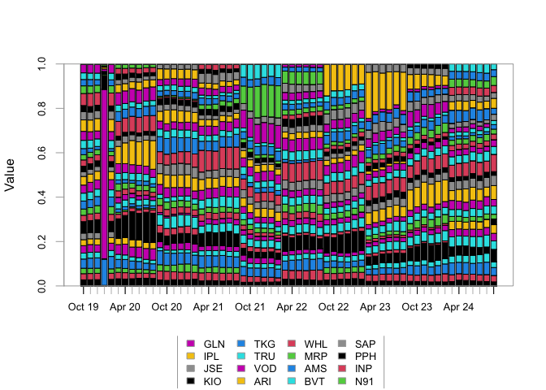

README
================
HENDRI VAN ZYL 17640296
2024-11-24

``` r
rm(list = ls()) # Clean your environment:
gc() # garbage collection
```

    ##          used (Mb) gc trigger (Mb) limit (Mb) max used (Mb)
    ## Ncells 493119 26.4    1058777 56.6         NA   700268 37.4
    ## Vcells 934797  7.2    8388608 64.0      16384  1963431 15.0

``` r
library(here)
library(fmxdat)
library(tbl2xts)
```

# INTRODUCTION

This README contains the planning, reasoning, considerations and
explanations behind my answers for the financial econometrics practical
exam.

Each answer is fully contained in a separate folder with relevant pdf
outputs, code etc.

# QUESTION 1: Systematic AI Fund

Goal: Compare our AI fund to benchmark (capped SWIX) and actively
managed funds of industry peers (ASISA) after costs using visualizations
in a powerpoint.

After having looked at the data it is clear that the AI fund will
outperform the Median Active manager

How:  
\* Cumulative returns (annualized) using a 3 year month rolling window
\* Show how rolling distributions of funds compare \*
Over/underperformance ratio \* Stratify and compare performance during
periods of high vs low valility (if I have enough time)

I see no info on costs for ASISA funds are available so I will argue
that if our returns are comparable then clearly the AI fund has
outperformed because costs still need to be deducted from the ASISA
returns.

## Data exploration

``` r
library(tidyverse)

# load data
ASISA_raw <- read_rds(here("data","ASISA_Rets.rds"))
BM_raw <- read_rds(here("data", "Capped_SWIX.rds"))
AI_Fund_raw <- read_rds(here("data","AI_Max_Fund.rds"))
```

Let’s check the data. Do we have NAs? What is the frequency?

``` r
AI_Fund_raw %>% 
  summarise(NA_Count = sum(is.na(AI_Fund)))
```

    ## # A tibble: 1 × 1
    ##   NA_Count
    ##      <int>
    ## 1        0

``` r
# 0 NAs

BM_raw %>% 
  summarise(NA_Count = sum(is.na(Returns)))
```

    ## # A tibble: 1 × 1
    ##   NA_Count
    ##      <int>
    ## 1        0

``` r
# 0 NAs 

sum(is.na(ASISA_raw$Returns))
```

    ## [1] 0

``` r
# 0 NAs

# Let's check the last dates in each df

# ASISA %>% select(date) %>% unique() %>% arrange(date) %>% tail()
# BM %>% select(date) %>% arrange(date) %>% tail()
# AI_Fund %>% select(date)  %>% arrange(date) %>% tail()

# Last date == 30 September 2023 for all dfs
```

No NAs. Monthly frequency. Let’s filter for non-indices in ASISA as we
only want actively managed funds.

``` r
ASISA <- ASISA_raw %>% 
  filter(Index == "No", FoF == "No") %>% select(-c(Index, FoF))


BM <- BM_raw %>% select(-Tickers)

# How many funds are there?

# ASISA %>% select(Fund) %>% unique() %>% count()

# 1021 funds in ASISA 
# We will be using the median
```

## Tyranny of Fees

Use Cum_Fee_Comparison function from `code` folder to demonstrate impact
of varying levels of fees on actively managed funds.

From this basis I can argue that if the AI Implementer equals the
performance of actively managed funds then it should clearly be the
preferred option as it does not incur these fees.

``` r
# Get median return for each month across all actively managed funds
ASISA_Median <- ASISA %>%
  group_by(date) %>%
  summarise(Median_Return = median(Returns, na.rm = TRUE)) %>%
  ungroup()

source(here("Question 1/code/Fee_comparison.R"))

Cum_Fee_Comparison(ASISA_Median %>% rename(Returns = Median_Return), Fee = 50*1e-4, Start = ymd(20100101), 
                               # Added purely for figure adjustment:
                               Gap = 3, Lvlset = 3,
                               mnthfwd = 18)
```

<!-- -->

## Rolling Returns

Rolling returns is a nice easy visual way to compare returns.

``` r
library(RcppRoll)

AI_Fund <- AI_Fund_raw
Active_Median <- ASISA_Median
# Merge all data into a single dataframe
Fund_ret <- AI_Fund %>%
  rename(AI_Return = AI_Fund) %>%
  left_join(BM %>% rename(BM_Return = Returns), by = "date") %>%
  left_join(Active_Median %>% rename(Active_Median_Return = Median_Return), by = "date") %>%
  pivot_longer(
    cols = -date, 
    names_to = "Tickers", 
    values_to = "Returns"
  )

Roll_ret <- Fund_ret %>%
    group_by(Tickers) %>%
    # Epic sorcery:
mutate(RollRets = RcppRoll::roll_prod(1 + Returns, 36, fill = NA,
    align = "right")^(12/36) - 1) %>%
    # Note this cool trick: it removes dates that have no
    # RollRets at all.
group_by(date) %>%
    filter(any(!is.na(RollRets))) %>%
    ungroup()

g <-
Roll_ret %>%
    filter(date > lubridate::ymd(20051231)) %>% 
    ggplot() + geom_line(aes(date, RollRets, color = Tickers),
    alpha = 0.7, size = 1.25) + labs(title = "Rolling 3 Year Annualized Returns Comparison",
    subtitle = "", x = "", y = "Rolling 3 year Returns (Ann.)",
    caption = "Note: Active Median Return represents the median return for actively managed funds each month") + theme_fmx(title.size = ggpts(30),
    subtitle.size = ggpts(5), caption.size = ggpts(25), CustomCaption = T) +
    fmx_cols()

ret_rol_plot <- fmxdat::finplot(g, x.date.dist = "1 year", x.date.type = "%Y", x.vert = T,
    y.pct = T, y.pct_acc = 1)

ret_rol_plot
```

<!-- -->

## Annualized Return and Risk

I decided against using this plot as using the Median of active funds
hides the underlying risky-ness of the stocks that comprise it.

If I have more time I would add a few random stocks that are in the top
25% of returns to compared in a plot like this

``` r
library(tbl2xts)
library(PerformanceAnalytics)
xts.returns <- Fund_ret %>% tbl_xts(tblData = ., cols_to_xts = Returns, spread_by = Tickers)
chart.RiskReturnScatter(R=xts.returns['2006-01-01/'][,c("AI_Return", "BM_Return", "Active_Median_Return")])
```

<!-- -->

## Rolling densities

I want to replicate the figure in the question, which illustrates the
overlapping densities for each funds density and marks the median. I do
this using geom_density function

``` r
plotdens <- Roll_ret %>% 
  filter(date > lubridate::ymd(20060101), Tickers != "Active_Mean_Return") %>% 
  ggplot(aes(x = RollRets)) + 
  geom_density(aes(fill = Tickers), alpha = 0.6) +
  geom_vline(data = . %>% filter(Tickers == "AI_Return") %>% summarise(median = median(RollRets, na.rm = TRUE)),
             aes(xintercept = median),
             linetype = "dashed", color = "green") +
  geom_vline(data = . %>% filter(Tickers == "BM_Return") %>% summarise(median = median(RollRets, na.rm = TRUE)),
             aes(xintercept = median),
             linetype = "dashed", color = "blue") +
  geom_vline(data = . %>% filter(Tickers == "Active_Median_Return") %>% summarise(median = median(RollRets, na.rm = TRUE)),
             aes(xintercept = median),
             linetype = "dashed", color = "red") +
  labs(
    title = "Rolling 3-Year Densities of Returns",
    subtitle = "Comparing AI Impelementer, Benchmark, and Active Median Returns",
    x = "Rolling Returns",
    y = "Density",
    fill = "Category"
  ) +
  theme_fmx()

plotdens
```

<!-- -->

## performance comparison

First get the relative performance, I’m keeping this simple, just the
difference between the respective fund and the benchmark at each point
in time.

``` r
idx <- AI_Fund %>%
  rename(AI_Return = AI_Fund) %>%
  left_join(BM %>% rename(BM_Return = Returns), by = "date") %>%
  left_join(Active_Median %>% rename(Active_Median_Return = Median_Return), by = "date") %>% 
  filter(date> lubridate::ymd(20061031))
# Calculate excess returns relative to the benchmark
relative_performance <- idx  %>%
  group_by(date) %>% 
  mutate(
    AI_vs_BM = AI_Return - BM_Return,           # AI Fund vs Benchmark
    ASISA_vs_BM = Active_Median_Return - BM_Return # ASISA Median vs Benchmark
  ) %>%
  select(date, AI_vs_BM, ASISA_vs_BM) %>% 
  ungroup()


# # Plot relative performance
# ggplot(relative_performance, aes(x = date)) +
#   geom_line(aes(y = AI_vs_BM, color = "AI Fund vs Benchmark"), size = 1.2) +
#   geom_line(aes(y = ASISA_vs_BM, color = "ASISA Median vs Benchmark"), size = 1.2) +
#   labs(
#     title = "Relative Performance of AI Fund and ASISA Median vs Benchmark",
#     subtitle = "Excess Returns Over the Benchmark",
#     x = "",
#     y = "Excess Returns",
#     color = "Legend"
#   ) +
#   theme_minimal()
```

Some initial plot setup

``` r
# Add shading for outperformance
g2 <-  relative_performance %>%
  mutate(
    AI_Outperform = ifelse(AI_vs_BM > 0, AI_vs_BM, NA),
    ASISA_Outperform = ifelse(ASISA_vs_BM > 0, ASISA_vs_BM, NA)
  ) %>%
  ggplot(aes(x = date)) +
  geom_line(aes(y = AI_vs_BM, color = "AI Fund vs Benchmark"), size = 1.2) +
  geom_line(aes(y = ASISA_vs_BM, color = "ASISA Median vs Benchmark"), size = 1.2) +
  geom_area(aes(y = AI_Outperform, fill = "AI Outperformance"), alpha = 0.3) +
  geom_area(aes(y = ASISA_Outperform, fill = "ASISA Outperformance"), alpha = 0.3) +
  labs(
    title = "Relative Performance of AI Fund and ASISA Median vs Benchmark",
    subtitle = "Shaded Areas Indicate Outperformance Over the Benchmark",
    x = "",
    y = "Excess Returns",
    color = "Legend",
    fill = "Outperformance"
  ) +
  theme_minimal()
```

calculate proportions of outperformance.

``` r
# Calculate proportions of outperformance
proportions <- relative_performance %>%
  summarise(
    AI_Proportion = mean(AI_vs_BM > 0, na.rm = TRUE),
    ASISA_Proportion = mean(ASISA_vs_BM > 0, na.rm = TRUE)
  )
print(proportions)
```

    ## # A tibble: 1 × 2
    ##   AI_Proportion ASISA_Proportion
    ##           <dbl>            <dbl>
    ## 1         0.571            0.453

Add outperformance to existing plot.

``` r
AI_Proportion <- proportions$AI_Proportion
ASISA_Proportion <- proportions$ASISA_Proportion

gg2 <- g2 + 
  annotate(
    "text",
    x = as.Date("2015-01-01"), # Adjust x position as needed
    y = max(relative_performance$AI_vs_BM, na.rm = TRUE) * 0.9, # Adjust y position as needed
    label = paste0("AI Implementer > Benchmark: ", round(AI_Proportion * 100, 1), "%"),
    hjust = 0, size = 5, color = "steelblue"
  ) +
  annotate(
    "text",
    x = as.Date("2015-01-01"), # Adjust x position as needed
    y = max(relative_performance$ASISA_vs_BM, na.rm = TRUE) * 0.8, # Adjust y position as needed
    label = paste0("ASISA Median > Benchmark: ", round(ASISA_Proportion * 100, 1), "%"),
    hjust = 0, size = 5, color = "red"
  )+ theme_fmx()

gg2
```

<!-- -->

# QUESTION 2

``` r
Indexes <- read_rds(here("data", "Cncy_Hedge_Assets.rds"))
ZAR <- read_rds(here("data", "Monthly_zar.rds"))
```

## Replicating the plot

Let’s see if we can recreate the plot in the blogpost.

From the blog: “This translates to a 42% allocation to FTSE/JSE All
Share equities Index, 28% to the FTSE/JSE All Bond Index, 12% to the
Bloomberg Global Aggregate Bond Index, 18% to the MSCI ACWI Equities
Index”.

These are in the `Indexes.rds` file: J433: 42% ALBI: 28% Bbg_Agg: 12%
MSCI_ACWI: 18%

This is the weighting we will use for the portfolio.

Since we will be working across assets I will calculate simple returns.

Let’s first convert Bbg_Agg and MSCI_ACWI into rands so that all returns
have the same currency denomination.

``` r
# Merge ZAR exchange rate with Indexes
data <- Indexes %>%
  mutate(YM = format(date, "%Y_%b")) %>% 
  left_join(ZAR %>% 
              mutate(ZAR_Return = value/lag(value)-1)%>% 
              mutate(YM = format(date, "%Y_%b")) %>% 
              select(-c(date,Tickers)), by = "YM") 


## Convert USD returns to ZAR returns
#data_ZAR <- data %>%
#  mutate(
#    MSCI_ACWI_ZAR = MSCI_ACWI * value,  # Convert MSCI_ACWI to ZAR
#    Bbg_Agg_ZAR = Bbg_Agg * value)  # Convert BbgAfg to ZAR

# Convert ZAR to USD
data_USD <- data %>% 
  arrange(date) %>% 
  group_by(date) %>% 
  mutate(ALBI_USD = ALBI/value,
         J433_USD = J433/value) %>% 
  ungroup()

## Calculate portfolio returns
#Portf <- data_ZAR %>%
#  mutate(
#    # Hedged portfolio (fully in ZAR)
#    portfolio_hedged = 0.42 * J433 + 0.28 * ALBI + 0.12 * Bbg_Agg_ZAR + 0.18 * MSCI_ACWI_ZAR,
#    
#    # Unhedged portfolio (global components remain in USD)
#    portfolio_unhedged = 0.42 * J433 + 0.28 * ALBI +
#      0.12 * Bbg_Agg + 0.18 * MSCI_ACWI
#  )

Portf <- data_USD %>% 
  group_by(date) %>% 
  mutate(
    # Hedged portfolio (fully in USD)
    portfolio_hedged = 0.42 * J433_USD + 0.28 * ALBI_USD + 0.12 * Bbg_Agg + 0.18 * MSCI_ACWI,
    
    # Unhedged portfolio (global components remain in USD)
    portfolio_unhedged = 0.42 * J433 + 0.28 * ALBI +0.12 * Bbg_Agg + 0.18 * MSCI_ACWI
  ) %>% 
  ungroup()
```

``` r
# Load necessary libraries
library(ggplot2)
library(ggExtra)

# Calculate quadrant percentages
Portf <- Portf %>%
  mutate(
    quadrant = case_when(
      ZAR_Return < 0 & portfolio_unhedged >= 0 ~ "Top Left",
      ZAR_Return >= 0 & portfolio_unhedged >= 0 ~ "Top Right",
      ZAR_Return < 0 & portfolio_unhedged < 0 ~ "Bottom Left",
      ZAR_Return >= 0 & portfolio_unhedged < 0 ~ "Bottom Right"
    ),
    restricted_quadrant = case_when(
      ZAR_Return*100 < -2.5 & portfolio_unhedged >= 0 ~ "Restricted Top Left",
      ZAR_Return*100 < -2.5 & portfolio_unhedged < 0 ~ "Restricted Bottom Left",
      ZAR_Return*100 >= -2.5 & portfolio_unhedged >= 0 ~ "Restricted Top Right",
      ZAR_Return*100 >= -2.5 & portfolio_unhedged < 0 ~ "Restricted Bottom Right",
      TRUE ~ NA_character_
    )
  )

# Calculate percentages for original quadrants
quadrant_counts <- Portf %>%
  group_by(quadrant) %>%
  summarise(n = n()) %>%
  mutate(percentage = round(n / sum(n) * 100, 1))

# Calculate percentages for restricted quadrants
restricted_counts <- Portf %>%
  filter(!is.na(restricted_quadrant)) %>%  # Only include restricted quadrants
  group_by(restricted_quadrant) %>%
  summarise(n = n()) %>%
  mutate(percentage = round(n / sum(n) * 100, 1))

# Prepare percentages for labels
percentage_TopLeft <- paste0(quadrant_counts$percentage[quadrant_counts$quadrant == "Top Left"], "%")
percentage_TopRight <- paste0(quadrant_counts$percentage[quadrant_counts$quadrant == "Top Right"], "%")
percentage_BottomLeft <- paste0(quadrant_counts$percentage[quadrant_counts$quadrant == "Bottom Left"], "%")
percentage_BottomRight <- paste0(quadrant_counts$percentage[quadrant_counts$quadrant == "Bottom Right"], "%")

# Restricted quadrant percentages
percentage_RestrictedTopLeft <- paste0(
  restricted_counts$percentage[restricted_counts$restricted_quadrant == "Restricted Top Left"], "%"
)
percentage_RestrictedBottomLeft <- paste0(
  restricted_counts$percentage[restricted_counts$restricted_quadrant == "Restricted Bottom Left"], "%"
)

# Generate scatter plot with updated quadrant label positions
scatter_plot <- ggplot(Portf, aes(x = ZAR_Return * 100, y = portfolio_unhedged * 100)) +
  # Add pastel background quadrants with gridlines visible
  geom_rect(aes(xmin = -20, xmax = 0, ymin = 0, ymax = 20), fill = "#FFDAB9", alpha = 0.9) +  # Light peach
  geom_rect(aes(xmin = 0, xmax = 20, ymin = 0, ymax = 20), fill = "#E6E6FA", alpha = 0.9) +  # Lavender
  geom_rect(aes(xmin = -20, xmax = 0, ymin = -20, ymax = 0), fill = "#B0E0E6", alpha = 0.5) + # Powder blue
  geom_rect(aes(xmin = 0, xmax = 20, ymin = -20, ymax = 0), fill = "#98FB98", alpha = 0.5) +  # Pale green

  # Add scatter points
  geom_point(alpha = 0.6) +

  # Add density contours with thinner and more opaque lines
  geom_density2d(color = "blue", size = 0.3, alpha = 0.8) +

  # Add regression line
  geom_smooth(method = "lm", color = "red", linetype = "solid", alpha = 0.9) +

  # Add solid zero lines
  geom_hline(yintercept = 0, linetype = "solid", color = "grey") +
  geom_vline(xintercept = 0, linetype = "solid", color = "grey") +

  # Add dashed line for hedging fee at -2.5%
  geom_vline(xintercept = -2.5, linetype = "dashed", color = "grey") +

  # Add quadrant percentage labels
  geom_label(aes(x = -20, y = 20, label = percentage_TopLeft), hjust = 0, vjust = 1, 
             size = 4, color = "black", fill = "white") +  # Top-left quadrant
  geom_label(aes(x = 20, y = 20, label = percentage_TopRight), hjust = 1, vjust = 1, 
             size = 4, color = "black", fill = "white") +  # Top-right quadrant (moved to top-right corner)
  geom_label(aes(x = -20, y = -20, label = percentage_BottomLeft), hjust = 0, vjust = 0, 
             size = 4, color = "black", fill = "white") + # Bottom-left quadrant
  geom_label(aes(x = 20, y = -20, label = percentage_BottomRight), hjust = 1, vjust = 0, 
             size = 4, color = "black", fill = "white") + # Bottom-right quadrant (moved to bottom-right corner)

  # Add restricted quadrant percentage labels
  geom_label(aes(x = -2.5, y = 20, label = percentage_RestrictedTopLeft), hjust = 1, vjust = 1, 
             size = 4, color = "black", fill = "white") +  # Restricted top-left quadrant
  geom_label(aes(x = -2.5, y = -20, label = percentage_RestrictedBottomLeft), hjust = 1, vjust = 0, 
             size = 4, color = "black", fill = "white") + # Restricted bottom-left quadrant

  # Add quadrant annotations with geom_label()
  geom_label(aes(x = -10, y = 13, label = "Hedge works but \n amplifies volatility"),
             hjust = 0.5, vjust = 0.5, size = 4, color = "black", fill = "white", alpha = 0.8) +
  geom_label(aes(x = 10, y = 13, label = "Hedge throws away \n returns"),
             hjust = 0.5, vjust = 0.5, size = 4, color = "black", fill = "white", alpha = 0.8) +
  geom_label(aes(x = -10, y = -13, label = "Best case for hedge: \n higher return, lower volatility"),
             hjust = 0.5, vjust = 0.5, size = 4, color = "black", fill = "white", alpha = 0.8) +
  geom_label(aes(x = 10, y = -13, label = "Hedge removes \n currency cushion"),
             hjust = 0.5, vjust = 0.5, size = 4, color = "black", fill = "white", alpha = 0.8) +

  # Set axis limits and labels
  scale_x_continuous(limits = c(-20, 20), breaks = seq(-20, 20, 10), labels = function(x) paste0(x, "%")) +
  scale_y_continuous(limits = c(-20, 20), breaks = seq(-20, 20, 10), labels = function(y) paste0(y, "%")) +

  # Add labels and theme
  labs(
    title = "Scatter Plot of USD/ZAR returns vs Portfolio returns",
    x = "USD-ZAR Exchange Rate Returns (%)",
    y = "60/40 Global Portfolio Returns (USD) (%)"
  ) +
  theme_minimal()

# Add marginal density plots with increased opacity
ggExtra::ggMarginal(scatter_plot, type = "density", fill = "grey", alpha = 0.7)
```

<!-- -->

``` r
#ggsave(here("Question 2/plots/scatter.png"), plot = scatter_plot, width = 10, height = 7, dpi = 300)
```

Success

## Rolling volatity

Using Rccp package I calculate the 2 year rolling standard deviation
between the hedged and unhedged portfolios.

``` r
combo_df <- Portf %>% 
  select(date, portfolio_hedged, portfolio_unhedged) %>% 
  pivot_longer(-date, names_to = "Type", values_to = "Returns") %>% 
  group_by(Type) %>% 
  mutate(RollSD = RcppRoll::roll_sd(1 + Returns, 24, fill = NA, align = "right") *
    sqrt(12)) %>%
    filter(!is.na(RollSD))

i <- combo_df %>%
    ggplot() + geom_line(aes(date, RollSD, color = Type),
    alpha = 0.7, size = 1.25) + labs(title = "Rolling 2 Year Annualized Standard Devation Comparison",
    subtitle = "", x = "", y = "Rolling 2 year Returns (Ann.)",
    caption = "Note:") + theme_fmx(title.size = ggpts(30),
    subtitle.size = ggpts(5), caption.size = ggpts(25), CustomCaption = T) +
    fmx_cols()

roll_sd_port <- finplot(i, x.date.dist = "1 year", x.date.type = "%Y", x.vert = T,
    y.pct = T, y.pct_acc = 1)

#ggsave(here("Question 2/plots/roll_sd_port.png"), plot = roll_sd_port, width = 6, height = 4, dpi = 300)

roll_sd_port
```

<!-- -->

# QUESTION 3

``` r
ALSI <- read_rds(here("data", "ALSI.rds"))
RebDays <- read_rds(here("data", "Rebalance_days.rds"))
```

## Investigation allocation

Let’s see how sector weights differ between indices

``` r
# Load required libraries
library(dplyr)
library(ggplot2)
library(patchwork) # For combining plots

# Step 1: Aggregate Data by Sector and Date
sector_allocation <- ALSI %>%
  group_by(date, Sector) %>%
  summarise(
    J203_sum = sum(J203, na.rm = TRUE),
    J403_sum = sum(J403, na.rm = TRUE),
    .groups = "drop"
  ) %>%
  group_by(date) %>%
  mutate(
    J203_share = J203_sum / sum(J203_sum, na.rm = TRUE),
    J403_share = J403_sum / sum(J403_sum, na.rm = TRUE)
  )

# Step 2: Plot Sector Allocation for J203
plot_j203 <- ggplot(sector_allocation, aes(x = date, y = J203_share, fill = Sector)) +
  geom_area(position = "stack") +
  labs(
    title = "J203",
    y = "Proportion"
  ) +
  theme_minimal() +
  theme(
    legend.position = "none", # legend is shared by both figs
    axis.title.x = element_blank() # Remove x-axis label
  )

# Step 3: Plot Sector Allocation for J403
plot_j403 <- ggplot(sector_allocation, aes(x = date, y = J403_share, fill = Sector)) +
  geom_area(position = "stack") +
  labs(
    title = "J403",
    y = "Proportion"
  ) +
  theme_minimal() +
  theme(
    legend.position = "none", # Legend will be shared
    axis.title.x = element_blank() # Remove x-axis label
  )

# Step 4: Combine the Two Plots with Shared Legend and Main Title
combined_plot <- (plot_j203 / plot_j403) +
  plot_layout(guides = "collect") & 
  theme(
    legend.position = "bottom",
    plot.title = element_text(hjust = 0.5, face = "bold")
  )

# Add a main title
combined_plot <- combined_plot + plot_annotation(
  title = "Sector Allocation Over Time"
)

combined_plot
```

<!-- -->

``` r
#ggsave(here("Question 3/plots/sectweights.png"), plot = combined_plot, width = 8, height = 5, dpi = 300)
```

``` r
# Load required libraries
library(dplyr)
library(ggplot2)
library(patchwork) # For combining plots

# Step 1: Update Index_Name for Ticker == "RBW"
ALSI <- ALSI %>%
  mutate(Index_Name = ifelse(Tickers == "RBW", "Mid_Caps", Index_Name))

# Step 2: Aggregate Data by Index_Name and Date
index_allocation <- ALSI %>%
  group_by(date, Index_Name) %>%
  summarise(
    J203_sum = sum(J203, na.rm = TRUE),
    J403_sum = sum(J403, na.rm = TRUE),
    .groups = "drop"
  ) %>%
  group_by(date) %>%
  mutate(
    J203_share = J203_sum / sum(J203_sum, na.rm = TRUE),
    J403_share = J403_sum / sum(J403_sum, na.rm = TRUE)
  )

# Step 3: Plot Allocation for J203
plot_j203 <- ggplot(index_allocation, aes(x = date, y = J203_share, fill = Index_Name)) +
  geom_area(position = "stack") +
  labs(
    title = "J203",
    y = "Proportion"
  ) +
  theme_minimal() +
  theme(
    legend.position = "none", # Legend will be shared
    axis.title.x = element_blank() # Remove x-axis label
  )

# Step 4: Plot Allocation for J403
plot_j403 <- ggplot(index_allocation, aes(x = date, y = J403_share, fill = Index_Name)) +
  geom_area(position = "stack") +
  labs(
    title = "J403",
    y = "Proportion"
  ) +
  theme_minimal() +
  theme(
    legend.position = "none", # Legend will be shared
    axis.title.x = element_blank() # Remove x-axis label
  )

# Step 5: Combine the Two Plots with Shared Legend and Main Title
combined_plot <- (plot_j203 / plot_j403) +
  plot_layout(guides = "collect") & 
  theme(
    legend.position = "bottom",
    plot.title = element_text(hjust = 0.5, face = "bold")
  )

# Add a main title
index_plot <- combined_plot + plot_annotation(
  title = "Index Allocation Over Time"
)

# Display the Combined Plot
index_plot
```

<!-- -->

``` r
# ggsave(here("Question 3/plots/index_plot.png"), plot = index_plot, width = 8, height = 5, dpi = 300)
```

## Performance

``` r
# Load required libraries
library(dplyr)
library(ggplot2)

# Step 1: Calculate Weighted Returns for Each Index
cumulative_returns <- ALSI %>%
  group_by(date) %>%
  summarise(
    J203_weighted_return = sum(Return * J203, na.rm = TRUE), # Weighted return for J203
    J403_weighted_return = sum(Return * J403, na.rm = TRUE), # Weighted return for J403
    .groups = "drop"
  ) %>%
  mutate(
    J203_cum_return = cumprod(1 + J203_weighted_return), # Cumulative return for J203
    J403_cum_return = cumprod(1 + J403_weighted_return)  # Cumulative return for J403
  )

# Step 2: Reshape Data for Plotting
cumulative_returns_long <- cumulative_returns %>%
  select(date, J203_cum_return, J403_cum_return) %>%
  pivot_longer(
    cols = starts_with("J"),
    names_to = "Index",
    values_to = "Cumulative_Return"
  )

# Step 3: Plot Cumulative Returns
cumulative_plot <- ggplot(cumulative_returns_long, aes(x = date, y = Cumulative_Return, color = Index)) +
  geom_line(size = 1) +
  labs(
    title = "Cumulative Returns for J203 and J403",
    x = "",
    y = "Cumulative Return",
    color = "Index"
  ) +
  theme_minimal() +
  theme(
    legend.position = "bottom",
    plot.title = element_text(hjust = 0.5, face = "bold")
  )
cumret <- fmxdat::finplot(cumulative_plot, x.date.dist = "1 year", x.date.type = "%Y", x.vert = T,
    y.pct = T, y.pct_acc = 1)

# Display the Plot
print(cumret)
```

<!-- -->

``` r
#ggsave(here("Question 3/plots/cumret.png"), plot = cumret, width = 8, height = 5, dpi = 300)
```

Let’s compare the volatility

``` r
library(RcppRoll)

# Step 1: Calculate weighted returns for each index
rolling_sd_df <- ALSI %>%
  group_by(date) %>%
  summarise(
    J203_weighted_return = sum(Return * J203, na.rm = TRUE), # Weighted return for J203
    J403_weighted_return = sum(Return * J403, na.rm = TRUE), # Weighted return for J403
    .groups = "drop"
  ) %>%
  pivot_longer(
    cols = starts_with("J"),
    names_to = "Index",
    values_to = "Returns"
  ) %>%
  group_by(Index) %>%
  mutate(
    RollSD = RcppRoll::roll_sd(1 + Returns, 24, fill = NA, align = "right") * sqrt(12) # Annualized rolling SD
  ) %>%
  filter(!is.na(RollSD))

# Step 2: Plot the rolling 2-year standard deviation
i <- rolling_sd_df %>%
  ggplot() +
  geom_line(aes(date, RollSD, color = Index), alpha = 0.7, size = 1.25) +
  labs(
    title = "Rolling 2-Year Annualized Standard Deviation Comparison",
    x = "",
    y = "Rolling 2-Year Returns (Ann.)",
    caption = "Note: Monthly data, annualized SD calculated over a 24-month rolling window"
  ) +
  theme_minimal() +
  theme(
    plot.title = element_text(hjust = 0.5, face = "bold"),
    legend.position = "bottom"
  )

# Display the plot
print(i)
```

<!-- -->

``` r
# Load required libraries

library(PerformanceAnalytics)

# Step 1: Filter data for the last 2 years
last_two_years <- ALSI %>%
  filter(date >= max(date) - lubridate::years(2)) %>%
  group_by(date) %>%
  summarise(
    J203_weighted_return = sum(Return * J203, na.rm = TRUE),
    J403_weighted_return = sum(Return * J403, na.rm = TRUE),
    .groups = "drop"
  )

# Step 2: Compute Expected Shortfall
# Convert data to xts for PerformanceAnalytics compatibility
returns_xts <- xts::xts(
  last_two_years %>% select(J203_weighted_return, J403_weighted_return),
  order.by = last_two_years$date
)

# Calculate Expected Shortfall (at 95% confidence level)
es_values <- PerformanceAnalytics::ES(
  R = returns_xts,
  p = 0.05,
  method = "historical"
)

# Step 3: Print the Expected Shortfall results
es_results <- tibble::tibble(
  Index = c("J203", "J403"),
  Expected_Shortfall = as.numeric(es_values)
)

# Display the results
print(es_results)
```

    ## # A tibble: 2 × 2
    ##   Index Expected_Shortfall
    ##   <chr>              <dbl>
    ## 1 J203             -0.0246
    ## 2 J403             -0.0239

## Stratifcation on Rand Volatility

I couldn’t finish this one in time.

``` r
# Step 1: Compute monthly ZAR volatility
zar_volatility <- ZAR %>%
  mutate(return = value/lag(value)-1) %>% 
  mutate(Year = format(date, "%Y")) %>%
  group_by(Year) %>%
  summarise(SD = sd(return, na.rm = TRUE)) %>%
  ungroup() %>%
  mutate(
    TopQtile = quantile(SD, 0.8, na.rm = TRUE),  # Top quintile for high volatility
    BotQtile = quantile(SD, 0.2, na.rm = TRUE)   # Bottom quintile for low volatility
  )

# Identify high and low volatility periods
Hi_Vol <- zar_volatility %>% filter(SD > TopQtile) %>% pull(Year)
Low_Vol <- zar_volatility %>% filter(SD < BotQtile) %>% pull(Year)

# Step 2: Prepare the index returns (weighted returns for J203 and J403)
Idxs <- ALSI %>%
  group_by(date) %>%
  summarise(
    J203_weighted_return = sum(Return * J203, na.rm = TRUE),
    J403_weighted_return = sum(Return * J403, na.rm = TRUE),
    .groups = "drop"
  ) %>%
  mutate(
    Year = format(date, "%Y")
  )

# Winsorize returns at 1% and 99% levels
Idxs <- Idxs %>%
  mutate(
    Top_J203 = quantile(J203_weighted_return, 0.99, na.rm = TRUE),
    Bot_J203 = quantile(J203_weighted_return, 0.01, na.rm = TRUE),
    Top_J403 = quantile(J403_weighted_return, 0.99, na.rm = TRUE),
    Bot_J403 = quantile(J403_weighted_return, 0.01, na.rm = TRUE),
    J203_winsorized = pmin(pmax(J203_weighted_return, Bot_J203), Top_J203),
    J403_winsorized = pmin(pmax(J403_weighted_return, Bot_J403), Top_J403)
  )

# Step 3: Compare performance during high and low volatility periods
Perf_comparisons <- function(Idxs, YMs, Alias) {
  Idxs %>%
    filter(Year %in% YMs) %>%
    summarise(
      Period = Alias,
      J203_SD = sd(J203_winsorized, na.rm = TRUE) * sqrt(12),  # Annualized SD
      J403_SD = sd(J403_winsorized, na.rm = TRUE) * sqrt(12),  # Annualized SD
      J203_Mean = mean(J203_winsorized, na.rm = TRUE),         # Mean return
      J403_Mean = mean(J403_winsorized, na.rm = TRUE)          # Mean return
    )
}

perf_hi <- Perf_comparisons(Idxs, YMs = Hi_Vol, Alias = "High Volatility")
perf_lo <- Perf_comparisons(Idxs, YMs = Low_Vol, Alias = "Low Volatility")

# Combine results
comparison_results <- bind_rows(perf_hi, perf_lo)

# Step 4: Visualize the results
comparison_plot <- comparison_results %>%
  pivot_longer(cols = starts_with("J"), names_to = "Metric", values_to = "Value") %>%
  ggplot(aes(x = Period, y = Value, fill = Metric)) +
  geom_bar(stat = "identity", position = "dodge") +
  labs(
    title = "Performance of J203 and J403 During Different ZAR Volatility Periods",
    x = "Volatility Period",
    y = "Metric Value",
    fill = "Metric"
  ) +
  theme_minimal()

# Display the results and plot
print(comparison_results)
```

    ## # A tibble: 2 × 5
    ##   Period          J203_SD J403_SD  J203_Mean  J403_Mean
    ##   <chr>             <dbl>   <dbl>      <dbl>      <dbl>
    ## 1 High Volatility  0.0391  0.0401   0.000293   0.000205
    ## 2 Low Volatility  NA      NA      NaN        NaN

``` r
print(comparison_plot)
```

<!-- -->

# QUESTION 4

``` r
Port_Holds <- read_rds(here("data", "Fund_Holds.rds"))
Port_Rets <- read_rds(here("data", "Fund_Rets.rds"))
BM_Holds <- read_rds(here("data", "BM_Holds.rds"))
BM_Rets <- read_rds(here("data", "BM_Rets.rds"))
```

Check that there are no NAs

``` r
Port_Holds %>% select(Weight) %>% is.na() %>% sum()
```

    ## [1] 0

``` r
Port_Holds %>% select(Tickers) %>% is.na() %>% sum()
```

    ## [1] 0

``` r
Port_Rets %>% select(Returns) %>% is.na() %>% sum()
```

    ## [1] 0

``` r
BM_Rets %>% select(BM) %>% is.na() %>% sum()
```

    ## [1] 0

``` r
# There are no NAs
# the dates 
```

Let’s create one df from the returns data and use the financial stats
function from the practical to create a table of summary statistics

``` r
# Check if the date columns are identical
# identical(Port_Rets$date, BM_Rets$date)

# True so safe to merge

library(tidyverse)
library(fmxdat)
library(lubridate)
library(xts)
library(tbl2xts)

# some initial setup

Snake_Oil_Rets <- Port_Rets %>% 
  select(-Portolio)


Funds <- Snake_Oil_Rets %>% 
  rename(Snake_Oil_Returns = Returns) %>% 
  left_join(BM_Rets, by = "date") %>% 
  filter(date>first(date)) %>% 
  pivot_longer(-date, names_to = "Tickers", values_to = "Ret")
```

## Stats table

Create a table of financial statistics using practical function to
create the table, function stored in `code`.

``` r
library(gt)
source(here("Question 4/code/4.1_Mom_Comp_func.R"))

Tab_stats <- Moments_Comp(Funds, "BM", 5, 0.8)

Make_perc <- 
  
  c( "Cum Returns", "Returns (Ann.)", "Returns Excess (Ann.)", "SD (Ann.)",
     "Avg DD", "Tracking Error")

Rows_to_Perc <- 
  
  Tab_stats %>% mutate(RN=row_number()) %>% filter(Info %in% Make_perc) %>% pull(RN)

colnams <- colnames(Tab_stats)[-1:-2]

Cols_length <- ncol(Tab_stats)

tab <- 
  
  Tab_stats %>% 
  
  gt::gt(groupname_col = 'Period', caption = 'SnakeOilCapital Moments Comparison') %>% 
  
  # Set a dynamic title with the benchmark name
  tab_header(title = "Index Statistics: Relative to Benchmark") %>% 
  
  # Format percentage rows
  fmt_percent(
    columns = 3:Cols_length,
    rows = Rows_to_Perc,
    decimals = 1
  ) %>%   
  
  # Replace missing values with a cleaner text or leave blank
  sub_missing(
    columns = all_of(colnams),
    missing_text = "N/A"
  ) %>%
  
  # Style the row group headers
  tab_style(
    style = list(
      cell_fill(color = 'lightgray', alpha = 0.1),
      cell_text(size = 'large', weight = 'bold', align = 'center')
    ),
    locations = cells_row_groups()
  ) %>% 
  
  # Style and align the column headers
  tab_style(
    style = cell_text(weight = 'bold', align = 'center', size = 'medium'), 
    locations = cells_column_labels(everything())
  ) %>%
  
  # Align all data cells in columns to center
  tab_style(
    style = cell_text(align = 'center'),
    locations = cells_body(columns = everything())
  ) %>%
  
  # Improve overall table options
  tab_options(
    table.width = pct(100),
    table.font.size = px(12),
    column_labels.font.size = px(14),
    data_row.padding = px(6),
    column_labels.vlines.width = 1
  )

# To save this, use:
gt::gtsave(tab, file = '/Users/R/Hen_FM_practical/Question 4/plots/Tab.png')

# In your rmd, you can now reference it using:
# )

tab
```

<div id="hcqnhkujmq" style="padding-left:0px;padding-right:0px;padding-top:10px;padding-bottom:10px;overflow-x:auto;overflow-y:auto;width:auto;height:auto;">
<style>#hcqnhkujmq table {
  font-family: system-ui, 'Segoe UI', Roboto, Helvetica, Arial, sans-serif, 'Apple Color Emoji', 'Segoe UI Emoji', 'Segoe UI Symbol', 'Noto Color Emoji';
  -webkit-font-smoothing: antialiased;
  -moz-osx-font-smoothing: grayscale;
}
&#10;#hcqnhkujmq thead, #hcqnhkujmq tbody, #hcqnhkujmq tfoot, #hcqnhkujmq tr, #hcqnhkujmq td, #hcqnhkujmq th {
  border-style: none;
}
&#10;#hcqnhkujmq p {
  margin: 0;
  padding: 0;
}
&#10;#hcqnhkujmq .gt_table {
  display: table;
  border-collapse: collapse;
  line-height: normal;
  margin-left: auto;
  margin-right: auto;
  color: #333333;
  font-size: 12px;
  font-weight: normal;
  font-style: normal;
  background-color: #FFFFFF;
  width: 100%;
  border-top-style: solid;
  border-top-width: 2px;
  border-top-color: #A8A8A8;
  border-right-style: none;
  border-right-width: 2px;
  border-right-color: #D3D3D3;
  border-bottom-style: solid;
  border-bottom-width: 2px;
  border-bottom-color: #A8A8A8;
  border-left-style: none;
  border-left-width: 2px;
  border-left-color: #D3D3D3;
}
&#10;#hcqnhkujmq .gt_caption {
  padding-top: 4px;
  padding-bottom: 4px;
}
&#10;#hcqnhkujmq .gt_title {
  color: #333333;
  font-size: 125%;
  font-weight: initial;
  padding-top: 4px;
  padding-bottom: 4px;
  padding-left: 5px;
  padding-right: 5px;
  border-bottom-color: #FFFFFF;
  border-bottom-width: 0;
}
&#10;#hcqnhkujmq .gt_subtitle {
  color: #333333;
  font-size: 85%;
  font-weight: initial;
  padding-top: 3px;
  padding-bottom: 5px;
  padding-left: 5px;
  padding-right: 5px;
  border-top-color: #FFFFFF;
  border-top-width: 0;
}
&#10;#hcqnhkujmq .gt_heading {
  background-color: #FFFFFF;
  text-align: center;
  border-bottom-color: #FFFFFF;
  border-left-style: none;
  border-left-width: 1px;
  border-left-color: #D3D3D3;
  border-right-style: none;
  border-right-width: 1px;
  border-right-color: #D3D3D3;
}
&#10;#hcqnhkujmq .gt_bottom_border {
  border-bottom-style: solid;
  border-bottom-width: 2px;
  border-bottom-color: #D3D3D3;
}
&#10;#hcqnhkujmq .gt_col_headings {
  border-top-style: solid;
  border-top-width: 2px;
  border-top-color: #D3D3D3;
  border-bottom-style: solid;
  border-bottom-width: 2px;
  border-bottom-color: #D3D3D3;
  border-left-style: none;
  border-left-width: 1px;
  border-left-color: #D3D3D3;
  border-right-style: none;
  border-right-width: 1px;
  border-right-color: #D3D3D3;
}
&#10;#hcqnhkujmq .gt_col_heading {
  color: #333333;
  background-color: #FFFFFF;
  font-size: 14px;
  font-weight: normal;
  text-transform: inherit;
  border-left-style: none;
  border-left-width: 1px;
  border-left-color: #D3D3D3;
  border-right-style: none;
  border-right-width: 1px;
  border-right-color: #D3D3D3;
  vertical-align: bottom;
  padding-top: 5px;
  padding-bottom: 6px;
  padding-left: 5px;
  padding-right: 5px;
  overflow-x: hidden;
}
&#10;#hcqnhkujmq .gt_column_spanner_outer {
  color: #333333;
  background-color: #FFFFFF;
  font-size: 14px;
  font-weight: normal;
  text-transform: inherit;
  padding-top: 0;
  padding-bottom: 0;
  padding-left: 4px;
  padding-right: 4px;
}
&#10;#hcqnhkujmq .gt_column_spanner_outer:first-child {
  padding-left: 0;
}
&#10;#hcqnhkujmq .gt_column_spanner_outer:last-child {
  padding-right: 0;
}
&#10;#hcqnhkujmq .gt_column_spanner {
  border-bottom-style: solid;
  border-bottom-width: 2px;
  border-bottom-color: #D3D3D3;
  vertical-align: bottom;
  padding-top: 5px;
  padding-bottom: 5px;
  overflow-x: hidden;
  display: inline-block;
  width: 100%;
}
&#10;#hcqnhkujmq .gt_spanner_row {
  border-bottom-style: hidden;
}
&#10;#hcqnhkujmq .gt_group_heading {
  padding-top: 8px;
  padding-bottom: 8px;
  padding-left: 5px;
  padding-right: 5px;
  color: #333333;
  background-color: #FFFFFF;
  font-size: 100%;
  font-weight: initial;
  text-transform: inherit;
  border-top-style: solid;
  border-top-width: 2px;
  border-top-color: #D3D3D3;
  border-bottom-style: solid;
  border-bottom-width: 2px;
  border-bottom-color: #D3D3D3;
  border-left-style: none;
  border-left-width: 1px;
  border-left-color: #D3D3D3;
  border-right-style: none;
  border-right-width: 1px;
  border-right-color: #D3D3D3;
  vertical-align: middle;
  text-align: left;
}
&#10;#hcqnhkujmq .gt_empty_group_heading {
  padding: 0.5px;
  color: #333333;
  background-color: #FFFFFF;
  font-size: 100%;
  font-weight: initial;
  border-top-style: solid;
  border-top-width: 2px;
  border-top-color: #D3D3D3;
  border-bottom-style: solid;
  border-bottom-width: 2px;
  border-bottom-color: #D3D3D3;
  vertical-align: middle;
}
&#10;#hcqnhkujmq .gt_from_md > :first-child {
  margin-top: 0;
}
&#10;#hcqnhkujmq .gt_from_md > :last-child {
  margin-bottom: 0;
}
&#10;#hcqnhkujmq .gt_row {
  padding-top: 6px;
  padding-bottom: 6px;
  padding-left: 5px;
  padding-right: 5px;
  margin: 10px;
  border-top-style: solid;
  border-top-width: 1px;
  border-top-color: #D3D3D3;
  border-left-style: none;
  border-left-width: 1px;
  border-left-color: #D3D3D3;
  border-right-style: none;
  border-right-width: 1px;
  border-right-color: #D3D3D3;
  vertical-align: middle;
  overflow-x: hidden;
}
&#10;#hcqnhkujmq .gt_stub {
  color: #333333;
  background-color: #FFFFFF;
  font-size: 100%;
  font-weight: initial;
  text-transform: inherit;
  border-right-style: solid;
  border-right-width: 2px;
  border-right-color: #D3D3D3;
  padding-left: 5px;
  padding-right: 5px;
}
&#10;#hcqnhkujmq .gt_stub_row_group {
  color: #333333;
  background-color: #FFFFFF;
  font-size: 100%;
  font-weight: initial;
  text-transform: inherit;
  border-right-style: solid;
  border-right-width: 2px;
  border-right-color: #D3D3D3;
  padding-left: 5px;
  padding-right: 5px;
  vertical-align: top;
}
&#10;#hcqnhkujmq .gt_row_group_first td {
  border-top-width: 2px;
}
&#10;#hcqnhkujmq .gt_row_group_first th {
  border-top-width: 2px;
}
&#10;#hcqnhkujmq .gt_summary_row {
  color: #333333;
  background-color: #FFFFFF;
  text-transform: inherit;
  padding-top: 8px;
  padding-bottom: 8px;
  padding-left: 5px;
  padding-right: 5px;
}
&#10;#hcqnhkujmq .gt_first_summary_row {
  border-top-style: solid;
  border-top-color: #D3D3D3;
}
&#10;#hcqnhkujmq .gt_first_summary_row.thick {
  border-top-width: 2px;
}
&#10;#hcqnhkujmq .gt_last_summary_row {
  padding-top: 8px;
  padding-bottom: 8px;
  padding-left: 5px;
  padding-right: 5px;
  border-bottom-style: solid;
  border-bottom-width: 2px;
  border-bottom-color: #D3D3D3;
}
&#10;#hcqnhkujmq .gt_grand_summary_row {
  color: #333333;
  background-color: #FFFFFF;
  text-transform: inherit;
  padding-top: 8px;
  padding-bottom: 8px;
  padding-left: 5px;
  padding-right: 5px;
}
&#10;#hcqnhkujmq .gt_first_grand_summary_row {
  padding-top: 8px;
  padding-bottom: 8px;
  padding-left: 5px;
  padding-right: 5px;
  border-top-style: double;
  border-top-width: 6px;
  border-top-color: #D3D3D3;
}
&#10;#hcqnhkujmq .gt_last_grand_summary_row_top {
  padding-top: 8px;
  padding-bottom: 8px;
  padding-left: 5px;
  padding-right: 5px;
  border-bottom-style: double;
  border-bottom-width: 6px;
  border-bottom-color: #D3D3D3;
}
&#10;#hcqnhkujmq .gt_striped {
  background-color: rgba(128, 128, 128, 0.05);
}
&#10;#hcqnhkujmq .gt_table_body {
  border-top-style: solid;
  border-top-width: 2px;
  border-top-color: #D3D3D3;
  border-bottom-style: solid;
  border-bottom-width: 2px;
  border-bottom-color: #D3D3D3;
}
&#10;#hcqnhkujmq .gt_footnotes {
  color: #333333;
  background-color: #FFFFFF;
  border-bottom-style: none;
  border-bottom-width: 2px;
  border-bottom-color: #D3D3D3;
  border-left-style: none;
  border-left-width: 2px;
  border-left-color: #D3D3D3;
  border-right-style: none;
  border-right-width: 2px;
  border-right-color: #D3D3D3;
}
&#10;#hcqnhkujmq .gt_footnote {
  margin: 0px;
  font-size: 90%;
  padding-top: 4px;
  padding-bottom: 4px;
  padding-left: 5px;
  padding-right: 5px;
}
&#10;#hcqnhkujmq .gt_sourcenotes {
  color: #333333;
  background-color: #FFFFFF;
  border-bottom-style: none;
  border-bottom-width: 2px;
  border-bottom-color: #D3D3D3;
  border-left-style: none;
  border-left-width: 2px;
  border-left-color: #D3D3D3;
  border-right-style: none;
  border-right-width: 2px;
  border-right-color: #D3D3D3;
}
&#10;#hcqnhkujmq .gt_sourcenote {
  font-size: 90%;
  padding-top: 4px;
  padding-bottom: 4px;
  padding-left: 5px;
  padding-right: 5px;
}
&#10;#hcqnhkujmq .gt_left {
  text-align: left;
}
&#10;#hcqnhkujmq .gt_center {
  text-align: center;
}
&#10;#hcqnhkujmq .gt_right {
  text-align: right;
  font-variant-numeric: tabular-nums;
}
&#10;#hcqnhkujmq .gt_font_normal {
  font-weight: normal;
}
&#10;#hcqnhkujmq .gt_font_bold {
  font-weight: bold;
}
&#10;#hcqnhkujmq .gt_font_italic {
  font-style: italic;
}
&#10;#hcqnhkujmq .gt_super {
  font-size: 65%;
}
&#10;#hcqnhkujmq .gt_footnote_marks {
  font-size: 75%;
  vertical-align: 0.4em;
  position: initial;
}
&#10;#hcqnhkujmq .gt_asterisk {
  font-size: 100%;
  vertical-align: 0;
}
&#10;#hcqnhkujmq .gt_indent_1 {
  text-indent: 5px;
}
&#10;#hcqnhkujmq .gt_indent_2 {
  text-indent: 10px;
}
&#10;#hcqnhkujmq .gt_indent_3 {
  text-indent: 15px;
}
&#10;#hcqnhkujmq .gt_indent_4 {
  text-indent: 20px;
}
&#10;#hcqnhkujmq .gt_indent_5 {
  text-indent: 25px;
}
&#10;#hcqnhkujmq .katex-display {
  display: inline-flex !important;
  margin-bottom: 0.75em !important;
}
&#10;#hcqnhkujmq div.Reactable > div.rt-table > div.rt-thead > div.rt-tr.rt-tr-group-header > div.rt-th-group:after {
  height: 0px !important;
}
</style>
<table class="gt_table" data-quarto-disable-processing="false" data-quarto-bootstrap="false">
  <caption>SnakeOilCapital Moments Comparison</caption>
  <thead>
    <tr class="gt_heading">
      <td colspan="3" class="gt_heading gt_title gt_font_normal gt_bottom_border" style>Index Statistics: Relative to Benchmark</td>
    </tr>
    &#10;    <tr class="gt_col_headings">
      <th class="gt_col_heading gt_columns_bottom_border gt_left" rowspan="1" colspan="1" style="font-size: medium; text-align: center; font-weight: bold;" scope="col" id="Info">Info</th>
      <th class="gt_col_heading gt_columns_bottom_border gt_right" rowspan="1" colspan="1" style="font-size: medium; text-align: center; font-weight: bold;" scope="col" id="Snake_Oil_Returns">Snake_Oil_Returns</th>
      <th class="gt_col_heading gt_columns_bottom_border gt_right" rowspan="1" colspan="1" style="font-size: medium; text-align: center; font-weight: bold;" scope="col" id="BM">BM</th>
    </tr>
  </thead>
  <tbody class="gt_table_body">
    <tr class="gt_group_heading_row">
      <th colspan="3" class="gt_group_heading" style="background-color: rgba(211,211,211,0.1); font-size: large; text-align: center; font-weight: bold;" scope="colgroup" id="Last 5 Years">Last 5 Years</th>
    </tr>
    <tr class="gt_row_group_first"><td headers="Last 5 Years  Info" class="gt_row gt_left" style="text-align: center;">Cum Returns</td>
<td headers="Last 5 Years  Snake_Oil_Returns" class="gt_row gt_right" style="text-align: center;">62.7%</td>
<td headers="Last 5 Years  BM" class="gt_row gt_right" style="text-align: center;">67.9%</td></tr>
    <tr><td headers="Last 5 Years  Info" class="gt_row gt_left" style="text-align: center;">Returns (Ann.)</td>
<td headers="Last 5 Years  Snake_Oil_Returns" class="gt_row gt_right" style="text-align: center;">10.2%</td>
<td headers="Last 5 Years  BM" class="gt_row gt_right" style="text-align: center;">10.9%</td></tr>
    <tr><td headers="Last 5 Years  Info" class="gt_row gt_left" style="text-align: center;">Returns Excess (Ann.)</td>
<td headers="Last 5 Years  Snake_Oil_Returns" class="gt_row gt_right" style="text-align: center;">−0.6%</td>
<td headers="Last 5 Years  BM" class="gt_row gt_right" style="text-align: center;">0.0%</td></tr>
    <tr><td headers="Last 5 Years  Info" class="gt_row gt_left" style="text-align: center;">SD (Ann.)</td>
<td headers="Last 5 Years  Snake_Oil_Returns" class="gt_row gt_right" style="text-align: center;">15.7%</td>
<td headers="Last 5 Years  BM" class="gt_row gt_right" style="text-align: center;">17.1%</td></tr>
    <tr><td headers="Last 5 Years  Info" class="gt_row gt_left" style="text-align: center;">Adj. Sharpe Ratio</td>
<td headers="Last 5 Years  Snake_Oil_Returns" class="gt_row gt_right" style="text-align: center;">0.629</td>
<td headers="Last 5 Years  BM" class="gt_row gt_right" style="text-align: center;">0.583</td></tr>
    <tr><td headers="Last 5 Years  Info" class="gt_row gt_left" style="text-align: center;">Pain Index</td>
<td headers="Last 5 Years  Snake_Oil_Returns" class="gt_row gt_right" style="text-align: center;">0.037</td>
<td headers="Last 5 Years  BM" class="gt_row gt_right" style="text-align: center;">0.038</td></tr>
    <tr><td headers="Last 5 Years  Info" class="gt_row gt_left" style="text-align: center;">Avg DD</td>
<td headers="Last 5 Years  Snake_Oil_Returns" class="gt_row gt_right" style="text-align: center;">6.9%</td>
<td headers="Last 5 Years  BM" class="gt_row gt_right" style="text-align: center;">7.3%</td></tr>
    <tr><td headers="Last 5 Years  Info" class="gt_row gt_left" style="text-align: center;">Tracking Error</td>
<td headers="Last 5 Years  Snake_Oil_Returns" class="gt_row gt_right" style="text-align: center;">5.0%</td>
<td headers="Last 5 Years  BM" class="gt_row gt_right" style="text-align: center;">0.0%</td></tr>
    <tr><td headers="Last 5 Years  Info" class="gt_row gt_left" style="text-align: center;">Information Ratio</td>
<td headers="Last 5 Years  Snake_Oil_Returns" class="gt_row gt_right" style="text-align: center;">-0.138</td>
<td headers="Last 5 Years  BM" class="gt_row gt_right" style="text-align: center;">N/A</td></tr>
    <tr><td headers="Last 5 Years  Info" class="gt_row gt_left" style="text-align: center;">Beta</td>
<td headers="Last 5 Years  Snake_Oil_Returns" class="gt_row gt_right" style="text-align: center;">0.878</td>
<td headers="Last 5 Years  BM" class="gt_row gt_right" style="text-align: center;">1.000</td></tr>
    <tr><td headers="Last 5 Years  Info" class="gt_row gt_left" style="text-align: center;">Beta Bull</td>
<td headers="Last 5 Years  Snake_Oil_Returns" class="gt_row gt_right" style="text-align: center;">0.844</td>
<td headers="Last 5 Years  BM" class="gt_row gt_right" style="text-align: center;">1.000</td></tr>
    <tr><td headers="Last 5 Years  Info" class="gt_row gt_left" style="text-align: center;">Beta Bear</td>
<td headers="Last 5 Years  Snake_Oil_Returns" class="gt_row gt_right" style="text-align: center;">0.761</td>
<td headers="Last 5 Years  BM" class="gt_row gt_right" style="text-align: center;">1.000</td></tr>
    <tr><td headers="Last 5 Years  Info" class="gt_row gt_left" style="text-align: center;">Up-Down Ratio</td>
<td headers="Last 5 Years  Snake_Oil_Returns" class="gt_row gt_right" style="text-align: center;">0.361</td>
<td headers="Last 5 Years  BM" class="gt_row gt_right" style="text-align: center;">0.000</td></tr>
    <tr><td headers="Last 5 Years  Info" class="gt_row gt_left" style="text-align: center;">Modified CVaR</td>
<td headers="Last 5 Years  Snake_Oil_Returns" class="gt_row gt_right" style="text-align: center;">-0.093</td>
<td headers="Last 5 Years  BM" class="gt_row gt_right" style="text-align: center;">-0.122</td></tr>
  </tbody>
  &#10;  
</table>
</div>

## Data investigation

BM_Holds maps `Tickers` to `Sectors`, while Port_Holds only has
`Tickers`, let’s check if all `Port_Holds$Tickers` are contained in
BM_Holds.

``` r
unmatched_tickers <- setdiff(Port_Holds$Tickers, BM_Holds$Tickers)
unmatched_tickers
```

    ## character(0)

Identical, that means I can map from the one to the other

``` r
# Add Sector information to Port_Holds
Port_Holds_with_Sectors <- Port_Holds %>%
  left_join(
    BM_Holds %>% select(Tickers, Sector) %>% distinct(),
    by = "Tickers", relationship = "many-to-many"
  ) %>% 
  mutate(YM = format(date, "%Y %B"))

month_totals <- Port_Holds_with_Sectors %>% 
  group_by(YM) %>% 
  summarise(month_weight = sum(Weight))

head(month_totals, 5)
```

    ## # A tibble: 5 × 2
    ##   YM            month_weight
    ##   <chr>                <dbl>
    ## 1 2019 December         1   
    ## 2 2019 November         1   
    ## 3 2019 October          1   
    ## 4 2020 April            1.02
    ## 5 2020 August           1.02

Month totals not adding to one, this is suspicious.

I was having some trouble mapping the BM_Holds Sectors to Port_Holds
Tickers, Turns out some Tickers are associated with more than 1 Sector

``` r
# Check if each Ticker maps uniquely to one Sector
ticker_to_sector <- BM_Holds %>%
  group_by(Tickers) %>%
  summarize(unique_sectors = n_distinct(Sector)) %>%
  filter(unique_sectors > 1)

ticker_to_sector
```

    ## # A tibble: 3 × 2
    ##   Tickers unique_sectors
    ##   <chr>            <int>
    ## 1 AFT                  2
    ## 2 L4L                  2
    ## 3 MNP                  2

AFT, L4L and MNP were associated with 2 sectors each, I check each stock
on Listcorp.com on the internet to see which sector is most appropriate.

``` r
BM_Holds %>% filter(Tickers == "AFT") %>% select(Sector, name) %>% unique()
```

    ## # A tibble: 2 × 2
    ##   Sector      name       
    ##   <chr>       <chr>      
    ## 1 Industrials AFRIMAT LTD
    ## 2 Resources   AFRIMAT LTD

``` r
# I'm going to set AFT to industrials

BM_Holds %>% filter(Tickers == "L4L") %>% select(Sector, name) %>% unique()
```

    ## # A tibble: 2 × 2
    ##   Sector      name         
    ##   <chr>       <chr>        
    ## 1 Financials  LONG4LIFE LTD
    ## 2 Industrials LONG4LIFE LTD

``` r
# L4L to financials
BM_Holds %>% filter(Tickers == "MNP") %>% select(Sector, name) %>% unique()
```

    ## # A tibble: 2 × 2
    ##   Sector      name     
    ##   <chr>       <chr>    
    ## 1 Resources   MONDI PLC
    ## 2 Industrials MONDI PLC

``` r
# resources
```

Ensure consistency of Ticker to sector mapping

``` r
# Update the Sector column in BM_Holds
BM_Holds <- BM_Holds %>%
  mutate(
    Sector = case_when(
      Tickers == "AFT" ~ "Industrials",
      Tickers == "L4L" ~ "Financials",
      Tickers == "MNP" ~ "Resources",
      TRUE ~ Sector  # Keep the existing value for all other Tickers
    )
  )

# that seems to have worked 
```

Let’s recheck the monthly weights and see if they add to one now:

``` r
# Add Sector information to Port_Holds
Port_Holds_with_Sectors <- Port_Holds %>%
  left_join(
    BM_Holds %>% select(Tickers, Sector) %>% distinct(),
    by = "Tickers", relationship = "many-to-many"
  ) %>% 
  mutate(YM = format(date, "%Y %B"))

month_totals <- Port_Holds_with_Sectors %>% 
  group_by(YM) %>% 
  summarise(month_weight = sum(Weight))

month_totals %>% select(month_weight) %>% unique()
```

    ## # A tibble: 8 × 1
    ##   month_weight
    ##          <dbl>
    ## 1         1   
    ## 2         1   
    ## 3         1   
    ## 4         1   
    ## 5         1   
    ## 6         1   
    ## 7         1.00
    ## 8         1

Great they add to one now.

## Performance comparison

``` r
library(PerformanceAnalytics)
df <- Port_Holds_with_Sectors %>% 
  left_join(Port_Rets %>% select(date, Returns), by = "date") %>% 
  group_by(date, Tickers) %>% 
  mutate(contribution = Weight*Returns) %>% 
  ungroup()

df %>% select(Sector) %>% unique()
```

    ## # A tibble: 3 × 1
    ##   Sector     
    ##   <chr>      
    ## 1 Resources  
    ## 2 Industrials
    ## 3 Financials

``` r
# Top stock contributors/detractors
stock_contribution <- df %>%
  group_by(date, Tickers) %>%
  summarize(Contribution = sum(Weight * Returns, na.rm = TRUE), .groups = "drop")
```

``` r
# Filter data for the last year
last_year <- max(stock_contribution$date) - years(3)

top_contributors <- stock_contribution %>%
  filter(date > last_year) %>%                # Include only data from the last year
  group_by(Tickers) %>%
  summarize(Contribution = sum(Contribution, na.rm = TRUE)) %>%  # Sum contributions over the year
  arrange(desc(Contribution)) %>%
  slice(1:5) %>%
  mutate(Group = "Top Contributors")

top_detractors <- stock_contribution %>%
  filter(date > last_year) %>%                # Include only data from the last year
  group_by(Tickers) %>%
  summarize(Contribution = sum(Contribution, na.rm = TRUE)) %>%  # Sum contributions over the year
  arrange(Contribution) %>%                   # Sort in ascending order
  slice(1:5) %>%
  mutate(Group = "Bottom Contributors")

# Combine contributors and detractors into a single table
top_combined <- bind_rows(top_contributors, top_detractors) %>%
  select(Stock = Tickers, Contribution, Group)

# Create the gt table
top_combined_gt <- top_combined %>%
  gt(groupname_col = "Group") %>%
  tab_header(
    title = "Top and Bottom 5 Contributors to Returns in the Last 3 Years"
  ) %>%
  fmt_percent(
    columns = "Contribution",  # Format the Contribution column as percentages
    decimals = 2
  ) %>%
  cols_align(
    align = "center",
    columns = everything()
  ) %>%
  tab_options(
    table.width = pct(100),
    heading.align = "center"
  )

# Render the table
top_combined_gt
```

<div id="pgsjxxsjbs" style="padding-left:0px;padding-right:0px;padding-top:10px;padding-bottom:10px;overflow-x:auto;overflow-y:auto;width:auto;height:auto;">
<style>#pgsjxxsjbs table {
  font-family: system-ui, 'Segoe UI', Roboto, Helvetica, Arial, sans-serif, 'Apple Color Emoji', 'Segoe UI Emoji', 'Segoe UI Symbol', 'Noto Color Emoji';
  -webkit-font-smoothing: antialiased;
  -moz-osx-font-smoothing: grayscale;
}
&#10;#pgsjxxsjbs thead, #pgsjxxsjbs tbody, #pgsjxxsjbs tfoot, #pgsjxxsjbs tr, #pgsjxxsjbs td, #pgsjxxsjbs th {
  border-style: none;
}
&#10;#pgsjxxsjbs p {
  margin: 0;
  padding: 0;
}
&#10;#pgsjxxsjbs .gt_table {
  display: table;
  border-collapse: collapse;
  line-height: normal;
  margin-left: auto;
  margin-right: auto;
  color: #333333;
  font-size: 16px;
  font-weight: normal;
  font-style: normal;
  background-color: #FFFFFF;
  width: 100%;
  border-top-style: solid;
  border-top-width: 2px;
  border-top-color: #A8A8A8;
  border-right-style: none;
  border-right-width: 2px;
  border-right-color: #D3D3D3;
  border-bottom-style: solid;
  border-bottom-width: 2px;
  border-bottom-color: #A8A8A8;
  border-left-style: none;
  border-left-width: 2px;
  border-left-color: #D3D3D3;
}
&#10;#pgsjxxsjbs .gt_caption {
  padding-top: 4px;
  padding-bottom: 4px;
}
&#10;#pgsjxxsjbs .gt_title {
  color: #333333;
  font-size: 125%;
  font-weight: initial;
  padding-top: 4px;
  padding-bottom: 4px;
  padding-left: 5px;
  padding-right: 5px;
  border-bottom-color: #FFFFFF;
  border-bottom-width: 0;
}
&#10;#pgsjxxsjbs .gt_subtitle {
  color: #333333;
  font-size: 85%;
  font-weight: initial;
  padding-top: 3px;
  padding-bottom: 5px;
  padding-left: 5px;
  padding-right: 5px;
  border-top-color: #FFFFFF;
  border-top-width: 0;
}
&#10;#pgsjxxsjbs .gt_heading {
  background-color: #FFFFFF;
  text-align: center;
  border-bottom-color: #FFFFFF;
  border-left-style: none;
  border-left-width: 1px;
  border-left-color: #D3D3D3;
  border-right-style: none;
  border-right-width: 1px;
  border-right-color: #D3D3D3;
}
&#10;#pgsjxxsjbs .gt_bottom_border {
  border-bottom-style: solid;
  border-bottom-width: 2px;
  border-bottom-color: #D3D3D3;
}
&#10;#pgsjxxsjbs .gt_col_headings {
  border-top-style: solid;
  border-top-width: 2px;
  border-top-color: #D3D3D3;
  border-bottom-style: solid;
  border-bottom-width: 2px;
  border-bottom-color: #D3D3D3;
  border-left-style: none;
  border-left-width: 1px;
  border-left-color: #D3D3D3;
  border-right-style: none;
  border-right-width: 1px;
  border-right-color: #D3D3D3;
}
&#10;#pgsjxxsjbs .gt_col_heading {
  color: #333333;
  background-color: #FFFFFF;
  font-size: 100%;
  font-weight: normal;
  text-transform: inherit;
  border-left-style: none;
  border-left-width: 1px;
  border-left-color: #D3D3D3;
  border-right-style: none;
  border-right-width: 1px;
  border-right-color: #D3D3D3;
  vertical-align: bottom;
  padding-top: 5px;
  padding-bottom: 6px;
  padding-left: 5px;
  padding-right: 5px;
  overflow-x: hidden;
}
&#10;#pgsjxxsjbs .gt_column_spanner_outer {
  color: #333333;
  background-color: #FFFFFF;
  font-size: 100%;
  font-weight: normal;
  text-transform: inherit;
  padding-top: 0;
  padding-bottom: 0;
  padding-left: 4px;
  padding-right: 4px;
}
&#10;#pgsjxxsjbs .gt_column_spanner_outer:first-child {
  padding-left: 0;
}
&#10;#pgsjxxsjbs .gt_column_spanner_outer:last-child {
  padding-right: 0;
}
&#10;#pgsjxxsjbs .gt_column_spanner {
  border-bottom-style: solid;
  border-bottom-width: 2px;
  border-bottom-color: #D3D3D3;
  vertical-align: bottom;
  padding-top: 5px;
  padding-bottom: 5px;
  overflow-x: hidden;
  display: inline-block;
  width: 100%;
}
&#10;#pgsjxxsjbs .gt_spanner_row {
  border-bottom-style: hidden;
}
&#10;#pgsjxxsjbs .gt_group_heading {
  padding-top: 8px;
  padding-bottom: 8px;
  padding-left: 5px;
  padding-right: 5px;
  color: #333333;
  background-color: #FFFFFF;
  font-size: 100%;
  font-weight: initial;
  text-transform: inherit;
  border-top-style: solid;
  border-top-width: 2px;
  border-top-color: #D3D3D3;
  border-bottom-style: solid;
  border-bottom-width: 2px;
  border-bottom-color: #D3D3D3;
  border-left-style: none;
  border-left-width: 1px;
  border-left-color: #D3D3D3;
  border-right-style: none;
  border-right-width: 1px;
  border-right-color: #D3D3D3;
  vertical-align: middle;
  text-align: left;
}
&#10;#pgsjxxsjbs .gt_empty_group_heading {
  padding: 0.5px;
  color: #333333;
  background-color: #FFFFFF;
  font-size: 100%;
  font-weight: initial;
  border-top-style: solid;
  border-top-width: 2px;
  border-top-color: #D3D3D3;
  border-bottom-style: solid;
  border-bottom-width: 2px;
  border-bottom-color: #D3D3D3;
  vertical-align: middle;
}
&#10;#pgsjxxsjbs .gt_from_md > :first-child {
  margin-top: 0;
}
&#10;#pgsjxxsjbs .gt_from_md > :last-child {
  margin-bottom: 0;
}
&#10;#pgsjxxsjbs .gt_row {
  padding-top: 8px;
  padding-bottom: 8px;
  padding-left: 5px;
  padding-right: 5px;
  margin: 10px;
  border-top-style: solid;
  border-top-width: 1px;
  border-top-color: #D3D3D3;
  border-left-style: none;
  border-left-width: 1px;
  border-left-color: #D3D3D3;
  border-right-style: none;
  border-right-width: 1px;
  border-right-color: #D3D3D3;
  vertical-align: middle;
  overflow-x: hidden;
}
&#10;#pgsjxxsjbs .gt_stub {
  color: #333333;
  background-color: #FFFFFF;
  font-size: 100%;
  font-weight: initial;
  text-transform: inherit;
  border-right-style: solid;
  border-right-width: 2px;
  border-right-color: #D3D3D3;
  padding-left: 5px;
  padding-right: 5px;
}
&#10;#pgsjxxsjbs .gt_stub_row_group {
  color: #333333;
  background-color: #FFFFFF;
  font-size: 100%;
  font-weight: initial;
  text-transform: inherit;
  border-right-style: solid;
  border-right-width: 2px;
  border-right-color: #D3D3D3;
  padding-left: 5px;
  padding-right: 5px;
  vertical-align: top;
}
&#10;#pgsjxxsjbs .gt_row_group_first td {
  border-top-width: 2px;
}
&#10;#pgsjxxsjbs .gt_row_group_first th {
  border-top-width: 2px;
}
&#10;#pgsjxxsjbs .gt_summary_row {
  color: #333333;
  background-color: #FFFFFF;
  text-transform: inherit;
  padding-top: 8px;
  padding-bottom: 8px;
  padding-left: 5px;
  padding-right: 5px;
}
&#10;#pgsjxxsjbs .gt_first_summary_row {
  border-top-style: solid;
  border-top-color: #D3D3D3;
}
&#10;#pgsjxxsjbs .gt_first_summary_row.thick {
  border-top-width: 2px;
}
&#10;#pgsjxxsjbs .gt_last_summary_row {
  padding-top: 8px;
  padding-bottom: 8px;
  padding-left: 5px;
  padding-right: 5px;
  border-bottom-style: solid;
  border-bottom-width: 2px;
  border-bottom-color: #D3D3D3;
}
&#10;#pgsjxxsjbs .gt_grand_summary_row {
  color: #333333;
  background-color: #FFFFFF;
  text-transform: inherit;
  padding-top: 8px;
  padding-bottom: 8px;
  padding-left: 5px;
  padding-right: 5px;
}
&#10;#pgsjxxsjbs .gt_first_grand_summary_row {
  padding-top: 8px;
  padding-bottom: 8px;
  padding-left: 5px;
  padding-right: 5px;
  border-top-style: double;
  border-top-width: 6px;
  border-top-color: #D3D3D3;
}
&#10;#pgsjxxsjbs .gt_last_grand_summary_row_top {
  padding-top: 8px;
  padding-bottom: 8px;
  padding-left: 5px;
  padding-right: 5px;
  border-bottom-style: double;
  border-bottom-width: 6px;
  border-bottom-color: #D3D3D3;
}
&#10;#pgsjxxsjbs .gt_striped {
  background-color: rgba(128, 128, 128, 0.05);
}
&#10;#pgsjxxsjbs .gt_table_body {
  border-top-style: solid;
  border-top-width: 2px;
  border-top-color: #D3D3D3;
  border-bottom-style: solid;
  border-bottom-width: 2px;
  border-bottom-color: #D3D3D3;
}
&#10;#pgsjxxsjbs .gt_footnotes {
  color: #333333;
  background-color: #FFFFFF;
  border-bottom-style: none;
  border-bottom-width: 2px;
  border-bottom-color: #D3D3D3;
  border-left-style: none;
  border-left-width: 2px;
  border-left-color: #D3D3D3;
  border-right-style: none;
  border-right-width: 2px;
  border-right-color: #D3D3D3;
}
&#10;#pgsjxxsjbs .gt_footnote {
  margin: 0px;
  font-size: 90%;
  padding-top: 4px;
  padding-bottom: 4px;
  padding-left: 5px;
  padding-right: 5px;
}
&#10;#pgsjxxsjbs .gt_sourcenotes {
  color: #333333;
  background-color: #FFFFFF;
  border-bottom-style: none;
  border-bottom-width: 2px;
  border-bottom-color: #D3D3D3;
  border-left-style: none;
  border-left-width: 2px;
  border-left-color: #D3D3D3;
  border-right-style: none;
  border-right-width: 2px;
  border-right-color: #D3D3D3;
}
&#10;#pgsjxxsjbs .gt_sourcenote {
  font-size: 90%;
  padding-top: 4px;
  padding-bottom: 4px;
  padding-left: 5px;
  padding-right: 5px;
}
&#10;#pgsjxxsjbs .gt_left {
  text-align: left;
}
&#10;#pgsjxxsjbs .gt_center {
  text-align: center;
}
&#10;#pgsjxxsjbs .gt_right {
  text-align: right;
  font-variant-numeric: tabular-nums;
}
&#10;#pgsjxxsjbs .gt_font_normal {
  font-weight: normal;
}
&#10;#pgsjxxsjbs .gt_font_bold {
  font-weight: bold;
}
&#10;#pgsjxxsjbs .gt_font_italic {
  font-style: italic;
}
&#10;#pgsjxxsjbs .gt_super {
  font-size: 65%;
}
&#10;#pgsjxxsjbs .gt_footnote_marks {
  font-size: 75%;
  vertical-align: 0.4em;
  position: initial;
}
&#10;#pgsjxxsjbs .gt_asterisk {
  font-size: 100%;
  vertical-align: 0;
}
&#10;#pgsjxxsjbs .gt_indent_1 {
  text-indent: 5px;
}
&#10;#pgsjxxsjbs .gt_indent_2 {
  text-indent: 10px;
}
&#10;#pgsjxxsjbs .gt_indent_3 {
  text-indent: 15px;
}
&#10;#pgsjxxsjbs .gt_indent_4 {
  text-indent: 20px;
}
&#10;#pgsjxxsjbs .gt_indent_5 {
  text-indent: 25px;
}
&#10;#pgsjxxsjbs .katex-display {
  display: inline-flex !important;
  margin-bottom: 0.75em !important;
}
&#10;#pgsjxxsjbs div.Reactable > div.rt-table > div.rt-thead > div.rt-tr.rt-tr-group-header > div.rt-th-group:after {
  height: 0px !important;
}
</style>
<table class="gt_table" data-quarto-disable-processing="false" data-quarto-bootstrap="false">
  <thead>
    <tr class="gt_heading">
      <td colspan="2" class="gt_heading gt_title gt_font_normal gt_bottom_border" style>Top and Bottom 5 Contributors to Returns in the Last 3 Years</td>
    </tr>
    &#10;    <tr class="gt_col_headings">
      <th class="gt_col_heading gt_columns_bottom_border gt_center" rowspan="1" colspan="1" scope="col" id="Stock">Stock</th>
      <th class="gt_col_heading gt_columns_bottom_border gt_center" rowspan="1" colspan="1" scope="col" id="Contribution">Contribution</th>
    </tr>
  </thead>
  <tbody class="gt_table_body">
    <tr class="gt_group_heading_row">
      <th colspan="2" class="gt_group_heading" scope="colgroup" id="Top Contributors">Top Contributors</th>
    </tr>
    <tr class="gt_row_group_first"><td headers="Top Contributors  Stock" class="gt_row gt_center">EXX</td>
<td headers="Top Contributors  Contribution" class="gt_row gt_center">1.73%</td></tr>
    <tr><td headers="Top Contributors  Stock" class="gt_row gt_center">ARI</td>
<td headers="Top Contributors  Contribution" class="gt_row gt_center">1.71%</td></tr>
    <tr><td headers="Top Contributors  Stock" class="gt_row gt_center">KIO</td>
<td headers="Top Contributors  Contribution" class="gt_row gt_center">1.61%</td></tr>
    <tr><td headers="Top Contributors  Stock" class="gt_row gt_center">TGA</td>
<td headers="Top Contributors  Contribution" class="gt_row gt_center">1.60%</td></tr>
    <tr><td headers="Top Contributors  Stock" class="gt_row gt_center">IMP</td>
<td headers="Top Contributors  Contribution" class="gt_row gt_center">1.55%</td></tr>
    <tr class="gt_group_heading_row">
      <th colspan="2" class="gt_group_heading" scope="colgroup" id="Bottom Contributors">Bottom Contributors</th>
    </tr>
    <tr class="gt_row_group_first"><td headers="Bottom Contributors  Stock" class="gt_row gt_center">SHP</td>
<td headers="Bottom Contributors  Contribution" class="gt_row gt_center">−0.06%</td></tr>
    <tr><td headers="Bottom Contributors  Stock" class="gt_row gt_center">SPP</td>
<td headers="Bottom Contributors  Contribution" class="gt_row gt_center">−0.02%</td></tr>
    <tr><td headers="Bottom Contributors  Stock" class="gt_row gt_center">PPH</td>
<td headers="Bottom Contributors  Contribution" class="gt_row gt_center">0.03%</td></tr>
    <tr><td headers="Bottom Contributors  Stock" class="gt_row gt_center">PIK</td>
<td headers="Bottom Contributors  Contribution" class="gt_row gt_center">0.09%</td></tr>
    <tr><td headers="Bottom Contributors  Stock" class="gt_row gt_center">SLM</td>
<td headers="Bottom Contributors  Contribution" class="gt_row gt_center">0.10%</td></tr>
  </tbody>
  &#10;  
</table>
</div>

``` r
# gt::gtsave(top_combined_gt, file = '/Users/R/Hen_FM_practical/Question 4/plots/comb.png')
```

## Performance analytics package

Here I do the necessary setup to be able to use the canned PA functions.

``` r
test <- df %>% select(date, Tickers, contribution)

pacman::p_load("PerformanceAnalytics")

# Now we use the Safe_Return.portfolio function from PerformanceAnalytics
# Note, as with most PA functions, the inputs are xts and wide...
# Also, let's assume you are investing R1000 at the start:
Fund_Size_at_Start <- 1000

df_weight <- df %>% 
  select(date, Tickers, Weight) %>% 
  pivot_wider(, names_from = Tickers, values_from = Weight)

df_weight[is.na(df_weight)] <- 0
weights <- df_weight %>% tbl_xts()
  


df_Returns <- df %>% select(date, Tickers, Returns) %>% 
  pivot_wider(, names_from = Tickers, values_from = Returns)

df_Returns[is.na(df_Returns)] <- 0
xts_df_Returns <- df_Returns %>% tbl_xts()

    RetPort <- 
      rmsfuns::Safe_Return.portfolio(xts_df_Returns, 
                                     
                       weights = weights, lag_weights = TRUE,
                       
                       verbose = TRUE, contribution = TRUE, 
                       
                       value = Fund_Size_at_Start, geometric = TRUE) 
    
    # Clean and save portfolio returns and weights:
Contribution <- RetPort$"contribution" %>% xts_tbl() 

BPWeight <- RetPort$"BOP.Weight" %>% xts_tbl() 

BPValue <- RetPort$"BOP.Value" %>% xts_tbl()  

    names(Contribution) <- c("date", names(RetPort$"contribution"))
    names(BPWeight) <- c("date", names(RetPort$"BOP.Weight"))
    names(BPValue) <- c("date", names(RetPort$"BOP.Value"))

    # Let's bind all of these together now:
    
    df_port_return <- 
      left_join(df %>% select(date, Tickers, Returns),
                BPWeight %>% gather(Tickers, Weight, -date),
                by = c("date", "Tickers") ) %>% 
      
      left_join(.,
                BPValue %>% gather(Tickers, value_held, -date),
                by = c("date", "Tickers") ) %>% 
      
      left_join(.,
                Contribution %>% gather(Tickers, Contribution, -date),
                by = c("date", "Tickers"))
    
    # Calculate Portfolio Returns:
df_Portf <- 
    df_port_return %>% group_by(date) %>% summarise(PortfolioReturn = sum(Returns*Weight, na.rm =TRUE)) %>% 
      filter(PortfolioReturn != 0)


Cum_SO  <- 
df_Portf %>%
    mutate(SnakeOilCap = (cumprod(1 + PortfolioReturn))) %>% 
  # Start at 1
  mutate(SnakeOilCap = SnakeOilCap / first(SnakeOilCap)) %>% select(-PortfolioReturn)

Cum_BM <- BM_Rets %>% 
  mutate(Benchmark = (cumprod(1 + BM))) %>% 
  # Start at 1
  mutate(Benchmark = Benchmark / first(Benchmark)) %>% select(-BM)

Cum_Comp <- 
  left_join(Cum_SO, Cum_BM, by = "date") %>% gather(Type, Value, -date)


cumplot <- Cum_Comp %>% 
  group_by(Type) %>% 
  ggplot() +
  geom_line(aes(date, Value, color = Type)) +
  theme_bw() +
  labs(
    title = "Cumulative Wealth Index",  # Add the title
    x = "",                             # Empty x-axis label
    y = "Index"                         # y-axis label
  ) +
  scale_color_discrete(name = "")  # Make the legend title empty

# ggsave(here("Question 4/plots/cumplot.png"), plot = cumplot, width = 8, height = 5, dpi = 300)

cumplot
```

<!-- -->

``` r
stock_plot <- BPWeight %>% tbl_xts() %>% .[endpoints(.,'months')] %>% chart.StackedBar()
```

<!-- -->

``` r
## Specify the file name and dimensions for the PNG
#png(filename = "/Users/R/Hen_FM_practical/Question 4/plots/stock_plot.png", width = 800, height = 600)
#
## Generate the plot
#BPWeight %>% 
#  tbl_xts() %>% 
#  .[endpoints(., 'months')] %>% 
#  chart.StackedBar()
#
## Close the graphics device
#dev.off()

stock_plot
```

    ## $xlog
    ## [1] FALSE
    ## 
    ## $ylog
    ## [1] FALSE
    ## 
    ## $adj
    ## [1] 0.5
    ## 
    ## $ann
    ## [1] TRUE
    ## 
    ## $ask
    ## [1] FALSE
    ## 
    ## $bg
    ## [1] "white"
    ## 
    ## $bty
    ## [1] "o"
    ## 
    ## $cex
    ## [1] 1
    ## 
    ## $cex.axis
    ## [1] 1
    ## 
    ## $cex.lab
    ## [1] 1
    ## 
    ## $cex.main
    ## [1] 1.2
    ## 
    ## $cex.sub
    ## [1] 1
    ## 
    ## $col
    ## [1] "black"
    ## 
    ## $col.axis
    ## [1] "black"
    ## 
    ## $col.lab
    ## [1] "black"
    ## 
    ## $col.main
    ## [1] "black"
    ## 
    ## $col.sub
    ## [1] "black"
    ## 
    ## $crt
    ## [1] 0
    ## 
    ## $err
    ## [1] 0
    ## 
    ## $family
    ## [1] ""
    ## 
    ## $fg
    ## [1] "black"
    ## 
    ## $fig
    ## [1] 0.0000000 1.0000000 0.0000000 0.1428571
    ## 
    ## $fin
    ## [1] 7 5
    ## 
    ## $font
    ## [1] 1
    ## 
    ## $font.axis
    ## [1] 1
    ## 
    ## $font.lab
    ## [1] 1
    ## 
    ## $font.main
    ## [1] 2
    ## 
    ## $font.sub
    ## [1] 1
    ## 
    ## $lab
    ## [1] 5 5 7
    ## 
    ## $las
    ## [1] 0
    ## 
    ## $lend
    ## [1] "round"
    ## 
    ## $lheight
    ## [1] 1
    ## 
    ## $ljoin
    ## [1] "round"
    ## 
    ## $lmitre
    ## [1] 10
    ## 
    ## $lty
    ## [1] "solid"
    ## 
    ## $lwd
    ## [1] 1
    ## 
    ## $mai
    ## [1] 0.02 0.42 0.02 0.22
    ## 
    ## $mar
    ## [1] 5.1 4.1 4.1 2.1
    ## 
    ## $mex
    ## [1] 1
    ## 
    ## $mfcol
    ## [1] 1 1
    ## 
    ## $mfg
    ## [1] 1 1 1 1
    ## 
    ## $mfrow
    ## [1] 1 1
    ## 
    ## $mgp
    ## [1] 3 1 0
    ## 
    ## $mkh
    ## [1] 0.001
    ## 
    ## $new
    ## [1] TRUE
    ## 
    ## $oma
    ## [1] 0 0 0 0
    ## 
    ## $omd
    ## [1] 0 1 0 1
    ## 
    ## $omi
    ## [1] 0 0 0 0
    ## 
    ## $pch
    ## [1] 1
    ## 
    ## $pin
    ## [1] 5.76 3.16
    ## 
    ## $plt
    ## [1] 0.08857143 0.91142857 0.18400000 0.81600000
    ## 
    ## $ps
    ## [1] 12
    ## 
    ## $pty
    ## [1] "m"
    ## 
    ## $smo
    ## [1] 1
    ## 
    ## $srt
    ## [1] 0
    ## 
    ## $tck
    ## [1] NA
    ## 
    ## $tcl
    ## [1] -0.5
    ## 
    ## $usr
    ## [1] -0.04  1.04 -0.04  1.04
    ## 
    ## $xaxp
    ## [1] 0 1 5
    ## 
    ## $xaxs
    ## [1] "r"
    ## 
    ## $xaxt
    ## [1] "s"
    ## 
    ## $xpd
    ## [1] FALSE
    ## 
    ## $yaxp
    ## [1] 0 1 5
    ## 
    ## $yaxs
    ## [1] "r"
    ## 
    ## $yaxt
    ## [1] "s"
    ## 
    ## $ylbias
    ## [1] 0.2

``` r
VaR_plot <- chart.VaRSensitivity(R = df_Portf%>% tbl_xts(),
                     main = "VaR Sensitivity Plot",
                     methods=c("HistoricalVaR", "ModifiedVaR","GaussianVaR"),
                     colorset=bluefocus, lwd=2)
```

<!-- -->

``` r
## Specify the file name and dimensions for the PNG
#png(filename = "/Users/R/Hen_FM_practical/Question 4/plots/VaR.png", width = 800, height = 600)
#
#chart.VaRSensitivity(R = df_Portf%>% tbl_xts(),
#                     main = "VaR Sensitivity Plot",
#                     methods=c("HistoricalVaR", "ModifiedVaR","GaussianVaR"),
#                     colorset=bluefocus, lwd=2)
#
## Close the graphics device
#dev.off()

VaR_plot
```

    ## NULL

``` r
rol_var <- chart.BarVaR(df_Portf %>% tbl_xts(),
             main = "Data vs Empirical VaR using rolling approach",
             methods="HistoricalVaR")


# # Specify the file name and dimensions for the PNG
# png(filename = "/Users/R/Hen_FM_practical/Question 4/plots/rolvar.png", width = 800, height = 600)
# 
# chart.BarVaR(df_Portf %>% tbl_xts(),
#              main = "Data vs Empirical VaR using rolling approach",
#              methods="HistoricalVaR")
# 
# # Close the graphics device
# dev.off()

rol_var
```

<!-- -->

``` r
sector_weights <- df %>%
  group_by(date, Sector) %>% 
  summarise(Sector_weight = sum(Weight))


# Create the stacked bar chart
h <- ggplot(sector_weights, aes(x = date, y = Sector_weight, fill = Sector)) +
  geom_bar(stat = "identity") +
  scale_fill_brewer(palette = "Set1") +  
  theme_minimal() +
  labs(
    title = "SnakeOilCapital Composition over time",
    x = "",
    y = "Sector Weight",
    fill = ""
  ) +
  theme(
    axis.text.x = element_text(angle = 45, hjust = 1),  # Rotate x-axis labels for clarity
    legend.position = "bottom"  # Place the legend at the bottom
  )

sector_plot <- fmxdat::finplot(h, x.date.dist = "1 year", x.date.type = "%Y", x.vert = T,
    y.pct = T, y.pct_acc = 1)

# ggsave(here("Question 4/plots/sect.png"), plot = sector_plot, width = 8, height = 5, dpi = 300)

sector_plot
```

<!-- -->

``` r
combo_df <- Port_Rets %>% 
  select(-Portolio) %>% rename(SnakeOil = Returns) %>% 
  left_join(BM_Rets %>% rename(Benchmark = BM), by = "date") %>% 
  pivot_longer(-date, names_to = "Fund", values_to = "Returns") %>% 
  group_by(Fund) %>% 
  mutate(RollSD = RcppRoll::roll_sd(1 + Returns, 24, fill = NA, align = "right") *
    sqrt(12)) %>%
    filter(!is.na(RollSD))

i <- combo_df %>%
    ggplot() + geom_line(aes(date, RollSD, color = Fund),
    alpha = 0.7, size = 1.25) + labs(title = "Rolling 2 Year Annualized Standard Devation Comparison",
    subtitle = "", x = "", y = "Rolling 2 year Returns (Ann.)",
    caption = "Note:") + theme_fmx(title.size = ggpts(30),
    subtitle.size = ggpts(5), caption.size = ggpts(25), CustomCaption = T) +
    fmx_cols()

roll_sd <- finplot(i, x.date.dist = "1 year", x.date.type = "%Y", x.vert = T,
    y.pct = T, y.pct_acc = 1)

roll_sd
```

<!-- -->

``` r
# ggsave(here("Question 4/plots/rollsd.png"), plot = roll_sd, width = 8, height = 5, dpi = 300)
```

``` r
pacman::p_load(PortRisk)

# First get the contributions to overall portfolio return made by each stock:
Contribution <- RetPort$"contribution" %>% xts_tbl()

# # Notice that this adds up to the portfolio return at each date:
# left_join(Contribution %>% gather(Stocks, RetCont, -date) %>% group_by(date) %>% summarise(Verify_Ret = sum(RetCont)), 
#           RetPort$returns %>% xts_tbl, by = "date") %>% mutate(Diff = round(Verify_Ret - portfolio.returns, 5))
```

## Highest contributors to portfolio risk

``` r
# Now, let's consider the highest to lowest contributors to portfolio risk using ES (Expected Tail Loss or ETL):
ES_Risk_Contributors <- ETL(Contribution %>% tbl_xts(), portfolio_method="component") %>% 
  
  .$pct_contrib_MES %>% data.frame(Risk_Contrib = .) %>% 
  
  tibble::rownames_to_column("Tickers") %>% arrange(desc(Risk_Contrib))# %>% 

    #print(ES_Risk_Contributors)
    
toprisk <- head(ES_Risk_Contributors, 10)

BM_names_tick <- BM_Holds %>% 
  select(Tickers, name) %>% 
  mutate(name = case_when(Tickers == "BHG" ~ "BHP Group Limited",
                                                     TRUE ~ name))

toprisk_tab <- left_join(toprisk, BM_names_tick, by = "Tickers") %>% 
  unique() %>% select(Stock = name, "Risk Contribution" = Risk_Contrib)


# Render the table with gt
toprisk_gt <- toprisk_tab %>%
  gt() %>%
  tab_header(
    title = "Top 10 Expected Shortfall Risk contributors"  # Add the table title
  ) %>%
  fmt_percent(
    columns = "Risk Contribution",  # Format the "Risk Contribution" column as percentages
    decimals = 2
  ) %>%
  cols_align(
    align = "center",
    columns = everything()  # Center align all columns
  ) %>%
  tab_options(
    table.width = pct(100),  # Set table width to fill the slide/page
    heading.align = "center"  # Center align the title
  )

# Print the table
toprisk_gt
```

<div id="nhzpqgyxjk" style="padding-left:0px;padding-right:0px;padding-top:10px;padding-bottom:10px;overflow-x:auto;overflow-y:auto;width:auto;height:auto;">
<style>#nhzpqgyxjk table {
  font-family: system-ui, 'Segoe UI', Roboto, Helvetica, Arial, sans-serif, 'Apple Color Emoji', 'Segoe UI Emoji', 'Segoe UI Symbol', 'Noto Color Emoji';
  -webkit-font-smoothing: antialiased;
  -moz-osx-font-smoothing: grayscale;
}
&#10;#nhzpqgyxjk thead, #nhzpqgyxjk tbody, #nhzpqgyxjk tfoot, #nhzpqgyxjk tr, #nhzpqgyxjk td, #nhzpqgyxjk th {
  border-style: none;
}
&#10;#nhzpqgyxjk p {
  margin: 0;
  padding: 0;
}
&#10;#nhzpqgyxjk .gt_table {
  display: table;
  border-collapse: collapse;
  line-height: normal;
  margin-left: auto;
  margin-right: auto;
  color: #333333;
  font-size: 16px;
  font-weight: normal;
  font-style: normal;
  background-color: #FFFFFF;
  width: 100%;
  border-top-style: solid;
  border-top-width: 2px;
  border-top-color: #A8A8A8;
  border-right-style: none;
  border-right-width: 2px;
  border-right-color: #D3D3D3;
  border-bottom-style: solid;
  border-bottom-width: 2px;
  border-bottom-color: #A8A8A8;
  border-left-style: none;
  border-left-width: 2px;
  border-left-color: #D3D3D3;
}
&#10;#nhzpqgyxjk .gt_caption {
  padding-top: 4px;
  padding-bottom: 4px;
}
&#10;#nhzpqgyxjk .gt_title {
  color: #333333;
  font-size: 125%;
  font-weight: initial;
  padding-top: 4px;
  padding-bottom: 4px;
  padding-left: 5px;
  padding-right: 5px;
  border-bottom-color: #FFFFFF;
  border-bottom-width: 0;
}
&#10;#nhzpqgyxjk .gt_subtitle {
  color: #333333;
  font-size: 85%;
  font-weight: initial;
  padding-top: 3px;
  padding-bottom: 5px;
  padding-left: 5px;
  padding-right: 5px;
  border-top-color: #FFFFFF;
  border-top-width: 0;
}
&#10;#nhzpqgyxjk .gt_heading {
  background-color: #FFFFFF;
  text-align: center;
  border-bottom-color: #FFFFFF;
  border-left-style: none;
  border-left-width: 1px;
  border-left-color: #D3D3D3;
  border-right-style: none;
  border-right-width: 1px;
  border-right-color: #D3D3D3;
}
&#10;#nhzpqgyxjk .gt_bottom_border {
  border-bottom-style: solid;
  border-bottom-width: 2px;
  border-bottom-color: #D3D3D3;
}
&#10;#nhzpqgyxjk .gt_col_headings {
  border-top-style: solid;
  border-top-width: 2px;
  border-top-color: #D3D3D3;
  border-bottom-style: solid;
  border-bottom-width: 2px;
  border-bottom-color: #D3D3D3;
  border-left-style: none;
  border-left-width: 1px;
  border-left-color: #D3D3D3;
  border-right-style: none;
  border-right-width: 1px;
  border-right-color: #D3D3D3;
}
&#10;#nhzpqgyxjk .gt_col_heading {
  color: #333333;
  background-color: #FFFFFF;
  font-size: 100%;
  font-weight: normal;
  text-transform: inherit;
  border-left-style: none;
  border-left-width: 1px;
  border-left-color: #D3D3D3;
  border-right-style: none;
  border-right-width: 1px;
  border-right-color: #D3D3D3;
  vertical-align: bottom;
  padding-top: 5px;
  padding-bottom: 6px;
  padding-left: 5px;
  padding-right: 5px;
  overflow-x: hidden;
}
&#10;#nhzpqgyxjk .gt_column_spanner_outer {
  color: #333333;
  background-color: #FFFFFF;
  font-size: 100%;
  font-weight: normal;
  text-transform: inherit;
  padding-top: 0;
  padding-bottom: 0;
  padding-left: 4px;
  padding-right: 4px;
}
&#10;#nhzpqgyxjk .gt_column_spanner_outer:first-child {
  padding-left: 0;
}
&#10;#nhzpqgyxjk .gt_column_spanner_outer:last-child {
  padding-right: 0;
}
&#10;#nhzpqgyxjk .gt_column_spanner {
  border-bottom-style: solid;
  border-bottom-width: 2px;
  border-bottom-color: #D3D3D3;
  vertical-align: bottom;
  padding-top: 5px;
  padding-bottom: 5px;
  overflow-x: hidden;
  display: inline-block;
  width: 100%;
}
&#10;#nhzpqgyxjk .gt_spanner_row {
  border-bottom-style: hidden;
}
&#10;#nhzpqgyxjk .gt_group_heading {
  padding-top: 8px;
  padding-bottom: 8px;
  padding-left: 5px;
  padding-right: 5px;
  color: #333333;
  background-color: #FFFFFF;
  font-size: 100%;
  font-weight: initial;
  text-transform: inherit;
  border-top-style: solid;
  border-top-width: 2px;
  border-top-color: #D3D3D3;
  border-bottom-style: solid;
  border-bottom-width: 2px;
  border-bottom-color: #D3D3D3;
  border-left-style: none;
  border-left-width: 1px;
  border-left-color: #D3D3D3;
  border-right-style: none;
  border-right-width: 1px;
  border-right-color: #D3D3D3;
  vertical-align: middle;
  text-align: left;
}
&#10;#nhzpqgyxjk .gt_empty_group_heading {
  padding: 0.5px;
  color: #333333;
  background-color: #FFFFFF;
  font-size: 100%;
  font-weight: initial;
  border-top-style: solid;
  border-top-width: 2px;
  border-top-color: #D3D3D3;
  border-bottom-style: solid;
  border-bottom-width: 2px;
  border-bottom-color: #D3D3D3;
  vertical-align: middle;
}
&#10;#nhzpqgyxjk .gt_from_md > :first-child {
  margin-top: 0;
}
&#10;#nhzpqgyxjk .gt_from_md > :last-child {
  margin-bottom: 0;
}
&#10;#nhzpqgyxjk .gt_row {
  padding-top: 8px;
  padding-bottom: 8px;
  padding-left: 5px;
  padding-right: 5px;
  margin: 10px;
  border-top-style: solid;
  border-top-width: 1px;
  border-top-color: #D3D3D3;
  border-left-style: none;
  border-left-width: 1px;
  border-left-color: #D3D3D3;
  border-right-style: none;
  border-right-width: 1px;
  border-right-color: #D3D3D3;
  vertical-align: middle;
  overflow-x: hidden;
}
&#10;#nhzpqgyxjk .gt_stub {
  color: #333333;
  background-color: #FFFFFF;
  font-size: 100%;
  font-weight: initial;
  text-transform: inherit;
  border-right-style: solid;
  border-right-width: 2px;
  border-right-color: #D3D3D3;
  padding-left: 5px;
  padding-right: 5px;
}
&#10;#nhzpqgyxjk .gt_stub_row_group {
  color: #333333;
  background-color: #FFFFFF;
  font-size: 100%;
  font-weight: initial;
  text-transform: inherit;
  border-right-style: solid;
  border-right-width: 2px;
  border-right-color: #D3D3D3;
  padding-left: 5px;
  padding-right: 5px;
  vertical-align: top;
}
&#10;#nhzpqgyxjk .gt_row_group_first td {
  border-top-width: 2px;
}
&#10;#nhzpqgyxjk .gt_row_group_first th {
  border-top-width: 2px;
}
&#10;#nhzpqgyxjk .gt_summary_row {
  color: #333333;
  background-color: #FFFFFF;
  text-transform: inherit;
  padding-top: 8px;
  padding-bottom: 8px;
  padding-left: 5px;
  padding-right: 5px;
}
&#10;#nhzpqgyxjk .gt_first_summary_row {
  border-top-style: solid;
  border-top-color: #D3D3D3;
}
&#10;#nhzpqgyxjk .gt_first_summary_row.thick {
  border-top-width: 2px;
}
&#10;#nhzpqgyxjk .gt_last_summary_row {
  padding-top: 8px;
  padding-bottom: 8px;
  padding-left: 5px;
  padding-right: 5px;
  border-bottom-style: solid;
  border-bottom-width: 2px;
  border-bottom-color: #D3D3D3;
}
&#10;#nhzpqgyxjk .gt_grand_summary_row {
  color: #333333;
  background-color: #FFFFFF;
  text-transform: inherit;
  padding-top: 8px;
  padding-bottom: 8px;
  padding-left: 5px;
  padding-right: 5px;
}
&#10;#nhzpqgyxjk .gt_first_grand_summary_row {
  padding-top: 8px;
  padding-bottom: 8px;
  padding-left: 5px;
  padding-right: 5px;
  border-top-style: double;
  border-top-width: 6px;
  border-top-color: #D3D3D3;
}
&#10;#nhzpqgyxjk .gt_last_grand_summary_row_top {
  padding-top: 8px;
  padding-bottom: 8px;
  padding-left: 5px;
  padding-right: 5px;
  border-bottom-style: double;
  border-bottom-width: 6px;
  border-bottom-color: #D3D3D3;
}
&#10;#nhzpqgyxjk .gt_striped {
  background-color: rgba(128, 128, 128, 0.05);
}
&#10;#nhzpqgyxjk .gt_table_body {
  border-top-style: solid;
  border-top-width: 2px;
  border-top-color: #D3D3D3;
  border-bottom-style: solid;
  border-bottom-width: 2px;
  border-bottom-color: #D3D3D3;
}
&#10;#nhzpqgyxjk .gt_footnotes {
  color: #333333;
  background-color: #FFFFFF;
  border-bottom-style: none;
  border-bottom-width: 2px;
  border-bottom-color: #D3D3D3;
  border-left-style: none;
  border-left-width: 2px;
  border-left-color: #D3D3D3;
  border-right-style: none;
  border-right-width: 2px;
  border-right-color: #D3D3D3;
}
&#10;#nhzpqgyxjk .gt_footnote {
  margin: 0px;
  font-size: 90%;
  padding-top: 4px;
  padding-bottom: 4px;
  padding-left: 5px;
  padding-right: 5px;
}
&#10;#nhzpqgyxjk .gt_sourcenotes {
  color: #333333;
  background-color: #FFFFFF;
  border-bottom-style: none;
  border-bottom-width: 2px;
  border-bottom-color: #D3D3D3;
  border-left-style: none;
  border-left-width: 2px;
  border-left-color: #D3D3D3;
  border-right-style: none;
  border-right-width: 2px;
  border-right-color: #D3D3D3;
}
&#10;#nhzpqgyxjk .gt_sourcenote {
  font-size: 90%;
  padding-top: 4px;
  padding-bottom: 4px;
  padding-left: 5px;
  padding-right: 5px;
}
&#10;#nhzpqgyxjk .gt_left {
  text-align: left;
}
&#10;#nhzpqgyxjk .gt_center {
  text-align: center;
}
&#10;#nhzpqgyxjk .gt_right {
  text-align: right;
  font-variant-numeric: tabular-nums;
}
&#10;#nhzpqgyxjk .gt_font_normal {
  font-weight: normal;
}
&#10;#nhzpqgyxjk .gt_font_bold {
  font-weight: bold;
}
&#10;#nhzpqgyxjk .gt_font_italic {
  font-style: italic;
}
&#10;#nhzpqgyxjk .gt_super {
  font-size: 65%;
}
&#10;#nhzpqgyxjk .gt_footnote_marks {
  font-size: 75%;
  vertical-align: 0.4em;
  position: initial;
}
&#10;#nhzpqgyxjk .gt_asterisk {
  font-size: 100%;
  vertical-align: 0;
}
&#10;#nhzpqgyxjk .gt_indent_1 {
  text-indent: 5px;
}
&#10;#nhzpqgyxjk .gt_indent_2 {
  text-indent: 10px;
}
&#10;#nhzpqgyxjk .gt_indent_3 {
  text-indent: 15px;
}
&#10;#nhzpqgyxjk .gt_indent_4 {
  text-indent: 20px;
}
&#10;#nhzpqgyxjk .gt_indent_5 {
  text-indent: 25px;
}
&#10;#nhzpqgyxjk .katex-display {
  display: inline-flex !important;
  margin-bottom: 0.75em !important;
}
&#10;#nhzpqgyxjk div.Reactable > div.rt-table > div.rt-thead > div.rt-tr.rt-tr-group-header > div.rt-th-group:after {
  height: 0px !important;
}
</style>
<table class="gt_table" data-quarto-disable-processing="false" data-quarto-bootstrap="false">
  <thead>
    <tr class="gt_heading">
      <td colspan="2" class="gt_heading gt_title gt_font_normal gt_bottom_border" style>Top 10 Expected Shortfall Risk contributors</td>
    </tr>
    &#10;    <tr class="gt_col_headings">
      <th class="gt_col_heading gt_columns_bottom_border gt_center" rowspan="1" colspan="1" scope="col" id="Stock">Stock</th>
      <th class="gt_col_heading gt_columns_bottom_border gt_center" rowspan="1" colspan="1" scope="col" id="Risk-Contribution">Risk Contribution</th>
    </tr>
  </thead>
  <tbody class="gt_table_body">
    <tr><td headers="Stock" class="gt_row gt_center">KUMBA IRON ORE LTD</td>
<td headers="Risk Contribution" class="gt_row gt_center">7.36%</td></tr>
    <tr><td headers="Stock" class="gt_row gt_center">EXXARO RESOURCES LTD</td>
<td headers="Risk Contribution" class="gt_row gt_center">6.89%</td></tr>
    <tr><td headers="Stock" class="gt_row gt_center">AFRICAN RAINBOW</td>
<td headers="Risk Contribution" class="gt_row gt_center">5.29%</td></tr>
    <tr><td headers="Stock" class="gt_row gt_center">BHP Group Limited</td>
<td headers="Risk Contribution" class="gt_row gt_center">5.24%</td></tr>
    <tr><td headers="Stock" class="gt_row gt_center">BRITISH AMERICAN TOBACCO PLC</td>
<td headers="Risk Contribution" class="gt_row gt_center">4.52%</td></tr>
    <tr><td headers="Stock" class="gt_row gt_center">VODACOM GROUP LIMITED</td>
<td headers="Risk Contribution" class="gt_row gt_center">3.74%</td></tr>
    <tr><td headers="Stock" class="gt_row gt_center">GLENCORE PLC</td>
<td headers="Risk Contribution" class="gt_row gt_center">3.62%</td></tr>
    <tr><td headers="Stock" class="gt_row gt_center">TRUWORTHS</td>
<td headers="Risk Contribution" class="gt_row gt_center">3.29%</td></tr>
    <tr><td headers="Stock" class="gt_row gt_center">ABSA GROUP LTD</td>
<td headers="Risk Contribution" class="gt_row gt_center">3.28%</td></tr>
    <tr><td headers="Stock" class="gt_row gt_center">AVI LIMITED</td>
<td headers="Risk Contribution" class="gt_row gt_center">3.28%</td></tr>
  </tbody>
  &#10;  
</table>
</div>

``` r
#gt::gtsave(toprisk_gt, file = '/Users/R/Hen_FM_practical/Question 4/plots/toprisk.png')
```

``` r
tabdownside <-
  table.DownsideRisk(left_join(df_Portf %>% rename("SnakeOil" = PortfolioReturn), 
                               BM_Rets %>% rename("Benchmark" = BM), 
                               by = "date") %>% tbl_xts(.), 
                     ci = 0.95, Rf=0, MAR=0)
# Suppose I am only interested in specific elements of the table, then use:
tabdownside <- tabdownside[c(1,5,7,8:11),]
 

DownsideRiskEst <- tabdownside %>% data.frame() %>% tibble::rownames_to_column() %>% 
gt() %>% 
        tab_header(title = glue::glue("Downside Risk estimates")) %>% 
      fmt_percent(
      columns = 2:3,
      decimals = 2
    )

DownsideRiskEst
```

<div id="omhicdfnkx" style="padding-left:0px;padding-right:0px;padding-top:10px;padding-bottom:10px;overflow-x:auto;overflow-y:auto;width:auto;height:auto;">
<style>#omhicdfnkx table {
  font-family: system-ui, 'Segoe UI', Roboto, Helvetica, Arial, sans-serif, 'Apple Color Emoji', 'Segoe UI Emoji', 'Segoe UI Symbol', 'Noto Color Emoji';
  -webkit-font-smoothing: antialiased;
  -moz-osx-font-smoothing: grayscale;
}
&#10;#omhicdfnkx thead, #omhicdfnkx tbody, #omhicdfnkx tfoot, #omhicdfnkx tr, #omhicdfnkx td, #omhicdfnkx th {
  border-style: none;
}
&#10;#omhicdfnkx p {
  margin: 0;
  padding: 0;
}
&#10;#omhicdfnkx .gt_table {
  display: table;
  border-collapse: collapse;
  line-height: normal;
  margin-left: auto;
  margin-right: auto;
  color: #333333;
  font-size: 16px;
  font-weight: normal;
  font-style: normal;
  background-color: #FFFFFF;
  width: auto;
  border-top-style: solid;
  border-top-width: 2px;
  border-top-color: #A8A8A8;
  border-right-style: none;
  border-right-width: 2px;
  border-right-color: #D3D3D3;
  border-bottom-style: solid;
  border-bottom-width: 2px;
  border-bottom-color: #A8A8A8;
  border-left-style: none;
  border-left-width: 2px;
  border-left-color: #D3D3D3;
}
&#10;#omhicdfnkx .gt_caption {
  padding-top: 4px;
  padding-bottom: 4px;
}
&#10;#omhicdfnkx .gt_title {
  color: #333333;
  font-size: 125%;
  font-weight: initial;
  padding-top: 4px;
  padding-bottom: 4px;
  padding-left: 5px;
  padding-right: 5px;
  border-bottom-color: #FFFFFF;
  border-bottom-width: 0;
}
&#10;#omhicdfnkx .gt_subtitle {
  color: #333333;
  font-size: 85%;
  font-weight: initial;
  padding-top: 3px;
  padding-bottom: 5px;
  padding-left: 5px;
  padding-right: 5px;
  border-top-color: #FFFFFF;
  border-top-width: 0;
}
&#10;#omhicdfnkx .gt_heading {
  background-color: #FFFFFF;
  text-align: center;
  border-bottom-color: #FFFFFF;
  border-left-style: none;
  border-left-width: 1px;
  border-left-color: #D3D3D3;
  border-right-style: none;
  border-right-width: 1px;
  border-right-color: #D3D3D3;
}
&#10;#omhicdfnkx .gt_bottom_border {
  border-bottom-style: solid;
  border-bottom-width: 2px;
  border-bottom-color: #D3D3D3;
}
&#10;#omhicdfnkx .gt_col_headings {
  border-top-style: solid;
  border-top-width: 2px;
  border-top-color: #D3D3D3;
  border-bottom-style: solid;
  border-bottom-width: 2px;
  border-bottom-color: #D3D3D3;
  border-left-style: none;
  border-left-width: 1px;
  border-left-color: #D3D3D3;
  border-right-style: none;
  border-right-width: 1px;
  border-right-color: #D3D3D3;
}
&#10;#omhicdfnkx .gt_col_heading {
  color: #333333;
  background-color: #FFFFFF;
  font-size: 100%;
  font-weight: normal;
  text-transform: inherit;
  border-left-style: none;
  border-left-width: 1px;
  border-left-color: #D3D3D3;
  border-right-style: none;
  border-right-width: 1px;
  border-right-color: #D3D3D3;
  vertical-align: bottom;
  padding-top: 5px;
  padding-bottom: 6px;
  padding-left: 5px;
  padding-right: 5px;
  overflow-x: hidden;
}
&#10;#omhicdfnkx .gt_column_spanner_outer {
  color: #333333;
  background-color: #FFFFFF;
  font-size: 100%;
  font-weight: normal;
  text-transform: inherit;
  padding-top: 0;
  padding-bottom: 0;
  padding-left: 4px;
  padding-right: 4px;
}
&#10;#omhicdfnkx .gt_column_spanner_outer:first-child {
  padding-left: 0;
}
&#10;#omhicdfnkx .gt_column_spanner_outer:last-child {
  padding-right: 0;
}
&#10;#omhicdfnkx .gt_column_spanner {
  border-bottom-style: solid;
  border-bottom-width: 2px;
  border-bottom-color: #D3D3D3;
  vertical-align: bottom;
  padding-top: 5px;
  padding-bottom: 5px;
  overflow-x: hidden;
  display: inline-block;
  width: 100%;
}
&#10;#omhicdfnkx .gt_spanner_row {
  border-bottom-style: hidden;
}
&#10;#omhicdfnkx .gt_group_heading {
  padding-top: 8px;
  padding-bottom: 8px;
  padding-left: 5px;
  padding-right: 5px;
  color: #333333;
  background-color: #FFFFFF;
  font-size: 100%;
  font-weight: initial;
  text-transform: inherit;
  border-top-style: solid;
  border-top-width: 2px;
  border-top-color: #D3D3D3;
  border-bottom-style: solid;
  border-bottom-width: 2px;
  border-bottom-color: #D3D3D3;
  border-left-style: none;
  border-left-width: 1px;
  border-left-color: #D3D3D3;
  border-right-style: none;
  border-right-width: 1px;
  border-right-color: #D3D3D3;
  vertical-align: middle;
  text-align: left;
}
&#10;#omhicdfnkx .gt_empty_group_heading {
  padding: 0.5px;
  color: #333333;
  background-color: #FFFFFF;
  font-size: 100%;
  font-weight: initial;
  border-top-style: solid;
  border-top-width: 2px;
  border-top-color: #D3D3D3;
  border-bottom-style: solid;
  border-bottom-width: 2px;
  border-bottom-color: #D3D3D3;
  vertical-align: middle;
}
&#10;#omhicdfnkx .gt_from_md > :first-child {
  margin-top: 0;
}
&#10;#omhicdfnkx .gt_from_md > :last-child {
  margin-bottom: 0;
}
&#10;#omhicdfnkx .gt_row {
  padding-top: 8px;
  padding-bottom: 8px;
  padding-left: 5px;
  padding-right: 5px;
  margin: 10px;
  border-top-style: solid;
  border-top-width: 1px;
  border-top-color: #D3D3D3;
  border-left-style: none;
  border-left-width: 1px;
  border-left-color: #D3D3D3;
  border-right-style: none;
  border-right-width: 1px;
  border-right-color: #D3D3D3;
  vertical-align: middle;
  overflow-x: hidden;
}
&#10;#omhicdfnkx .gt_stub {
  color: #333333;
  background-color: #FFFFFF;
  font-size: 100%;
  font-weight: initial;
  text-transform: inherit;
  border-right-style: solid;
  border-right-width: 2px;
  border-right-color: #D3D3D3;
  padding-left: 5px;
  padding-right: 5px;
}
&#10;#omhicdfnkx .gt_stub_row_group {
  color: #333333;
  background-color: #FFFFFF;
  font-size: 100%;
  font-weight: initial;
  text-transform: inherit;
  border-right-style: solid;
  border-right-width: 2px;
  border-right-color: #D3D3D3;
  padding-left: 5px;
  padding-right: 5px;
  vertical-align: top;
}
&#10;#omhicdfnkx .gt_row_group_first td {
  border-top-width: 2px;
}
&#10;#omhicdfnkx .gt_row_group_first th {
  border-top-width: 2px;
}
&#10;#omhicdfnkx .gt_summary_row {
  color: #333333;
  background-color: #FFFFFF;
  text-transform: inherit;
  padding-top: 8px;
  padding-bottom: 8px;
  padding-left: 5px;
  padding-right: 5px;
}
&#10;#omhicdfnkx .gt_first_summary_row {
  border-top-style: solid;
  border-top-color: #D3D3D3;
}
&#10;#omhicdfnkx .gt_first_summary_row.thick {
  border-top-width: 2px;
}
&#10;#omhicdfnkx .gt_last_summary_row {
  padding-top: 8px;
  padding-bottom: 8px;
  padding-left: 5px;
  padding-right: 5px;
  border-bottom-style: solid;
  border-bottom-width: 2px;
  border-bottom-color: #D3D3D3;
}
&#10;#omhicdfnkx .gt_grand_summary_row {
  color: #333333;
  background-color: #FFFFFF;
  text-transform: inherit;
  padding-top: 8px;
  padding-bottom: 8px;
  padding-left: 5px;
  padding-right: 5px;
}
&#10;#omhicdfnkx .gt_first_grand_summary_row {
  padding-top: 8px;
  padding-bottom: 8px;
  padding-left: 5px;
  padding-right: 5px;
  border-top-style: double;
  border-top-width: 6px;
  border-top-color: #D3D3D3;
}
&#10;#omhicdfnkx .gt_last_grand_summary_row_top {
  padding-top: 8px;
  padding-bottom: 8px;
  padding-left: 5px;
  padding-right: 5px;
  border-bottom-style: double;
  border-bottom-width: 6px;
  border-bottom-color: #D3D3D3;
}
&#10;#omhicdfnkx .gt_striped {
  background-color: rgba(128, 128, 128, 0.05);
}
&#10;#omhicdfnkx .gt_table_body {
  border-top-style: solid;
  border-top-width: 2px;
  border-top-color: #D3D3D3;
  border-bottom-style: solid;
  border-bottom-width: 2px;
  border-bottom-color: #D3D3D3;
}
&#10;#omhicdfnkx .gt_footnotes {
  color: #333333;
  background-color: #FFFFFF;
  border-bottom-style: none;
  border-bottom-width: 2px;
  border-bottom-color: #D3D3D3;
  border-left-style: none;
  border-left-width: 2px;
  border-left-color: #D3D3D3;
  border-right-style: none;
  border-right-width: 2px;
  border-right-color: #D3D3D3;
}
&#10;#omhicdfnkx .gt_footnote {
  margin: 0px;
  font-size: 90%;
  padding-top: 4px;
  padding-bottom: 4px;
  padding-left: 5px;
  padding-right: 5px;
}
&#10;#omhicdfnkx .gt_sourcenotes {
  color: #333333;
  background-color: #FFFFFF;
  border-bottom-style: none;
  border-bottom-width: 2px;
  border-bottom-color: #D3D3D3;
  border-left-style: none;
  border-left-width: 2px;
  border-left-color: #D3D3D3;
  border-right-style: none;
  border-right-width: 2px;
  border-right-color: #D3D3D3;
}
&#10;#omhicdfnkx .gt_sourcenote {
  font-size: 90%;
  padding-top: 4px;
  padding-bottom: 4px;
  padding-left: 5px;
  padding-right: 5px;
}
&#10;#omhicdfnkx .gt_left {
  text-align: left;
}
&#10;#omhicdfnkx .gt_center {
  text-align: center;
}
&#10;#omhicdfnkx .gt_right {
  text-align: right;
  font-variant-numeric: tabular-nums;
}
&#10;#omhicdfnkx .gt_font_normal {
  font-weight: normal;
}
&#10;#omhicdfnkx .gt_font_bold {
  font-weight: bold;
}
&#10;#omhicdfnkx .gt_font_italic {
  font-style: italic;
}
&#10;#omhicdfnkx .gt_super {
  font-size: 65%;
}
&#10;#omhicdfnkx .gt_footnote_marks {
  font-size: 75%;
  vertical-align: 0.4em;
  position: initial;
}
&#10;#omhicdfnkx .gt_asterisk {
  font-size: 100%;
  vertical-align: 0;
}
&#10;#omhicdfnkx .gt_indent_1 {
  text-indent: 5px;
}
&#10;#omhicdfnkx .gt_indent_2 {
  text-indent: 10px;
}
&#10;#omhicdfnkx .gt_indent_3 {
  text-indent: 15px;
}
&#10;#omhicdfnkx .gt_indent_4 {
  text-indent: 20px;
}
&#10;#omhicdfnkx .gt_indent_5 {
  text-indent: 25px;
}
&#10;#omhicdfnkx .katex-display {
  display: inline-flex !important;
  margin-bottom: 0.75em !important;
}
&#10;#omhicdfnkx div.Reactable > div.rt-table > div.rt-thead > div.rt-tr.rt-tr-group-header > div.rt-th-group:after {
  height: 0px !important;
}
</style>
<table class="gt_table" data-quarto-disable-processing="false" data-quarto-bootstrap="false">
  <thead>
    <tr class="gt_heading">
      <td colspan="3" class="gt_heading gt_title gt_font_normal gt_bottom_border" style>Downside Risk estimates</td>
    </tr>
    &#10;    <tr class="gt_col_headings">
      <th class="gt_col_heading gt_columns_bottom_border gt_left" rowspan="1" colspan="1" scope="col" id="a::stub"></th>
      <th class="gt_col_heading gt_columns_bottom_border gt_right" rowspan="1" colspan="1" scope="col" id="SnakeOil">SnakeOil</th>
      <th class="gt_col_heading gt_columns_bottom_border gt_right" rowspan="1" colspan="1" scope="col" id="Benchmark">Benchmark</th>
    </tr>
  </thead>
  <tbody class="gt_table_body">
    <tr><th id="stub_1_1" scope="row" class="gt_row gt_left gt_stub">Semi Deviation</th>
<td headers="stub_1_1 SnakeOil" class="gt_row gt_right">3.33%</td>
<td headers="stub_1_1 Benchmark" class="gt_row gt_right">3.68%</td></tr>
    <tr><th id="stub_1_2" scope="row" class="gt_row gt_left gt_stub">Downside Deviation (Rf=0%)</th>
<td headers="stub_1_2 SnakeOil" class="gt_row gt_right">2.82%</td>
<td headers="stub_1_2 Benchmark" class="gt_row gt_right">3.17%</td></tr>
    <tr><th id="stub_1_3" scope="row" class="gt_row gt_left gt_stub">Maximum Drawdown</th>
<td headers="stub_1_3 SnakeOil" class="gt_row gt_right">21.29%</td>
<td headers="stub_1_3 Benchmark" class="gt_row gt_right">26.58%</td></tr>
    <tr><th id="stub_1_4" scope="row" class="gt_row gt_left gt_stub">Historical VaR (95%)</th>
<td headers="stub_1_4 SnakeOil" class="gt_row gt_right">−6.90%</td>
<td headers="stub_1_4 Benchmark" class="gt_row gt_right">−5.90%</td></tr>
    <tr><th id="stub_1_5" scope="row" class="gt_row gt_left gt_stub">Historical ES (95%)</th>
<td headers="stub_1_5 SnakeOil" class="gt_row gt_right">−9.79%</td>
<td headers="stub_1_5 Benchmark" class="gt_row gt_right">−11.24%</td></tr>
    <tr><th id="stub_1_6" scope="row" class="gt_row gt_left gt_stub">Modified VaR (95%)</th>
<td headers="stub_1_6 SnakeOil" class="gt_row gt_right">−6.72%</td>
<td headers="stub_1_6 Benchmark" class="gt_row gt_right">−7.52%</td></tr>
    <tr><th id="stub_1_7" scope="row" class="gt_row gt_left gt_stub">Modified ES (95%)</th>
<td headers="stub_1_7 SnakeOil" class="gt_row gt_right">−9.31%</td>
<td headers="stub_1_7 Benchmark" class="gt_row gt_right">−12.22%</td></tr>
  </tbody>
  &#10;  
</table>
</div>

``` r
# gt::gtsave(DownsideRiskEst, file = '/Users/R/Hen_FM_practical/Question 4/plots/downrisk.png')
```

# QUESTION 5

``` r
#cncy <- read_rds(here("data/currencies.rds"))
#cncy_Carry <- read_rds(here("data", "cncy Carry.rds"))
#cncy_value <- read_rds(here("data", "cncy value.rds"))
#cncyIV <- read_rds(here("data", "cncyIV.rds"))
#bbdxy <- read_rds(here("data", "bbdxy.rds"))
```

# QUESTION 6

``` r
#MAA <- read_rds(here("data", "MAA.rds"))
#msci <-read_rds(here("data", "msci.rds")) %>%
#filter(Name %in% c("MSCI ACWI", "MSCI USA", "MSCI RE", "MSCI Jap"))
```
